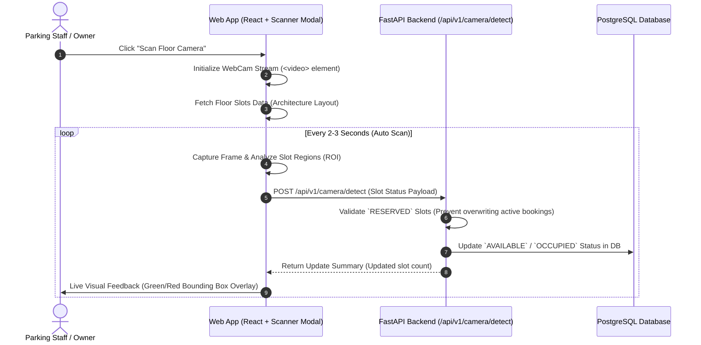

# Smart Parking Lot System - Camera Slot Detection Feature (မြန်မာဘာသာဖြင့် ရှင်းလင်းချက်)

ဤစာရွက်စာတမ်းသည် Smart Parking Lot System တွင် Web Camera ကိုအသုံးပြု၍ Parking Slot များ၏ အခြေအနေ (ကားရပ်ထားခြင်း ရှိ/မရှိ) ကို အလိုအလျောက် Detect ပြုလုပ်သည့် စနစ်၏ အလုပ်လုပ်ပုံနှင့် အသုံးပြုထားသော နည်းပညာများကို အဆင့်ဆင့် ရှင်းပြထားပါသည်။

---

## 1. နိဒါန်း (Overview)

Parking Staff သို့မဟုတ် Lot Owner များအနေဖြင့် Parking Slot Status (AVAILABLE / OCCUPIED) များကို မာနူရယ် တစ်ခုချင်းစီ လိုက်လံ Update လုပ်စရာမလိုဘဲ၊ Floor Slot Architecture အတိုင်း Web Camera / Webcam မှတစ်ဆင့် Slot အခြေအနေကို စကင်ဖတ် (Scan) ပြီး Real-time ရယူနိုင်သည့် AI Camera Scanner Feature ဖြစ်ပါသည်။

---

## 2. အသုံးပြုထားသော နည်းပညာများ (Techniques & Technologies Used)

| နည်းပညာ / Component | အသုံးပြုပုံ နှင့် အခန်းကဏ္ဍ |
| :--- | :--- |
| **HTML5 Media Capture & WebRTC** | Browser မှ Web Camera (သို့မဟုတ် USB Webcam) ကို တိုက်ရိုက် ရယူအသုံးပြုခြင်း |
| **HTML5 Canvas Processing** | Live Video Stream မှ Frame မ်ားကို Snapshot ရယူ၍ Pixel Matrix တွက်ချက်ခြင်း |
| **Coordinate Mapping & Visual Overlays** | Floor slots architecture အတိုင်း visual bounding boxes (စိမ်း/နီ) overlay ပြသပေးခြင်း |
| **YOLOv8 Deep Learning Model (Option)** | AI Object Detection (Car, Truck, Bus detect လုပ်ရန်) |
| **FastAPI Security & REST Service** | Backend `CameraDetectionService` မှ DB State machine များကို ဘေးကင်းစွာ update လုပ်ခြင်း |

---

## 3. Step-by-Step အလုပ်လုပ်ပုံ အဆင့်ဆင့် (Step-by-Step Workflow)

### အဆင့် (၁) - Camera Initialization & Live Stream
1. Staff သည် **Slots Board Page** သို့မဟုတ် **Floor Detail Page** မှ **"Scan Floor Camera"** Button ကို နှိပ်လိုက်ပါသည်။
2. Browser မှ `navigator.mediaDevices.getUserMedia` ကို အသုံးပြု၍ Web Camera Stream ကို စတင်ဖွင့်လှစ်ပါသည်။
3. `FloorCameraScannerModal` component မှ ၎င်း Floor တွင်ရှိသော Parking Slots Architecture Data ကို API မှ ရယူပါသည်။

### အဆင့် (၂) - Frame Capture & Image Processing
1. Scanner Modal သည် HTML5 `<canvas>` ကို သုံး၍ WebCam ရိုက်ကူးနေသော Live Video Feed မှ Snapshot (Image Frame) ကို ယူပါသည်။
2. Canvas Context မှ Slot တစ်ခုချင်းစီ၏ တည်နေရာ (Bounding Box / Region of Interest) များကို visual overlay အဖြစ် ရေးဆွဲပေးပါသည်။

### အဆင့် (၃) - AI / Object Detection Logic
1. Frame Capture မှ ရရှိလာသော Image Frame ကို backend AI Server (YOLOv8 Model) သို့ သို့မဟုတ် Browser Local Vision Processing သို့ ပို့ဆောင်ပါသည်။
2. Camera detection model သည် Vehicle Class ID များ (Car, Motorcycle, Bus, Truck) ကို ရှာဖွေပြီး Slot Polygon/Rectangle ROI ထဲတွင် ရှိ/မရှိ စစ်ဆေးပါသည်။

### အဆင့် (၄) - Safe Database Update (Business Protection Rules)
Backend မှ `CameraDetectionService` သည် အောက်ပါ Strict Rules များကို လိုက်နာ၍ DB တွင် Update လုပ်ပါသည်။
- **Rule 1 (Reserved Protection):** Slot သည် လက်ရှိအချိန်တွင် **`RESERVED`** (Customer မှ ကြိုတင် Booking ယူထားသောအဆင့်) ဖြစ်နေပါက Camera Detection မှ ၎င်း Slot ကို Absolute Overwrite မလုပ်ပါ (Booking System ကို မပျက်စီးစေရန်)။
- **Rule 2 (Change Detection Only):** Slot ၏ အခြေအနေ အပြောင်းအလဲရှိမှသာ DB Write Operation ပြုလုပ်ပါသည်။ (ဥပမာ - `AVAILABLE` မှ `OCCUPIED` သို့မဟုတ် `OCCUPIED` မှ `AVAILABLE` သို့ ပြောင်းလဲခြင်း)။
- **Rule 3 (Writable Statuses):** Camera Detection သည် `AVAILABLE` နှင့် `OCCUPIED` status နှစ်ခုကိုသာ ထိန်းချုပ်ခွင့်ရှိပါသည်။

### အဆင့် (၅) - Real-time Visual Feedback
- **စိမ်းရောင် Box (AVAILABLE):** Parking Slot လွတ်နေကြောင်း UI တွင် ပြသပေးပါသည်။
- **အနီရောင် Box (OCCUPIED):** Parking Slot တွင် ကားရပ်ထားကြောင်း UI တွင် ပြသပေးပါသည်။
- UI Slots Board တွင်လည်း Slot ရောင်စုံများ Automatic ပြောင်းလဲသွားပါသည်။

---

## 4. စနစ်၏ အဓိက အားသာချက်များ (Key Advantages)

1. **No Manual Update Required:** Staff များအနေဖြင့် Slot status များကို Manual လိုက်နှိပ်စရာမလိုဘဲ Camera ထိုးထားရုံဖြင့် အလိုအလျောက် Database update ဖြစ်သွားပါသည်။
2. **Integrated Web Solution:** သီးသန့် Software သုံးရန်မလိုဘဲ Website ပေါ်မှ Scan button နှိပ်ရုံဖြင့် WebCam ဖြင့် Direct Detect လုပ်နိုင်ပါသည်။
3. **Active Booking Safety:** Customer များ Book လုပ်ထားသော Slots (RESERVED) များကို AI Camera မှ မတော်တဆ Overwrite လုပ်မိခြင်းမှ ၁၀၀% ကာကွယ်ပေးထားပါသည်။
