# Smart Parking Lot Management System

### Project Documentation

---

> [!NOTE] 💡
> This document covers the full lifecycle of the Smart Parking Lot Management System — from its motivation and scope through its technical design, implementation details, and conclusions.

---

## Table of Contents

- [Chapter 1 — Introduction](#chapter-1--introduction)
  - [1.1 Introduction](#11-introduction)
  - [1.2 Scope](#12-scope)
  - [1.3 Problem Statement](#13-problem-statement)
  - [1.4 Motivation of the Project](#14-motivation-of-the-project)
  - [1.5 Project Objectives](#15-project-objectives)
  - [1.6 Background Technology](#16-background-technology)
- [Chapter 2 — System Design](#chapter-2--system-design)
  - [2.1 Schema Diagram](#21-schema-diagram)
  - [2.2 Class Diagram](#22-class-diagram)
  - [2.3 Use Case Diagram](#23-use-case-diagram)
  - [2.4 Sequence Diagram](#24-sequence-diagram)
- [Chapter 3 — Project Implementation](#chapter-3--project-implementation)
- [Chapter 4 — Conclusion and References](#chapter-4--conclusion-and-references)

---

# Chapter 1 — Introduction

## 1.1 Introduction

The **Smart Parking Lot Management System** is a full-stack, cloud-ready web platform designed to digitise and streamline the management of parking facilities. Traditional parking lots rely on manual entry-and-exit recording, paper-based ticketing, and cash-only payment methods — all of which are error-prone, inefficient, and difficult to scale. This system replaces those workflows with a centralised, role-based digital platform that connects every stakeholder — from system administrators and parking lot owners to operational staff and end-user customers — through a single, coherent set of web interfaces and a RESTful API backend.

The platform is composed of three independently deployable sub-systems:


| Sub-System                 | Technology                   | Purpose                                       |
| -------------------------- | ---------------------------- | --------------------------------------------- |
| `smart-parking-api`        | Python 3.12 / FastAPI        | RESTful backend API, business logic, database |
| `smart-parking-management` | React 19 / TypeScript / Vite | Admin, Owner, and Staff web portal            |
| `smart-parking-customer`   | React 19 / TypeScript / Vite | Customer-facing web application               |

All three components are containerised with Docker and can be orchestrated via `docker-compose` for both local development and cloud deployment (Render).

---

## 1.2 Scope

The system covers the following functional areas:

### In Scope

- **User Management & Authentication** — Registration, email OTP verification, JWT-based login with refresh tokens, role-based access control (RBAC) for four distinct user roles: `ADMIN`, `OWNER`, `STAFF`, and `CUSTOMER`.
- **Parking Infrastructure Management** — Hierarchical management of parking lots → floors → slots, including geo-location data (latitude/longitude) and Google Maps URL for each lot.
- **Booking & Session Lifecycle** — Customers book parking slots for specific time windows; sessions transition through `PENDING → ACTIVE → FINISHED` states with automatic fee calculation based on hourly rates.
- **Digital Wallet Payment Integration** — Integration with an external digital wallet backend for session fee and subscription payments, supporting an OTP-based payment confirmation flow.
- **Subscription Packages** — Admins define tiered subscription packages (with maximum lots and staff quotas); parking owners purchase subscriptions to unlock lot-creation capabilities.
- **Analytics Dashboard** — Role-specific dashboards surface revenue summaries, occupancy statistics, session counts, and subscription status.
- **3D Parking Lot Visualisation** — The customer app renders an interactive, three-dimensional view of parking floors and slot availability.

### Out of Scope

- Hardware integration (barrier gates, ANPR cameras, IoT sensors)
- Native mobile applications (iOS / Android)
- Multi-currency support
- Self-service password reset via email (noted as a known limitation)

---

## 1.3 Problem Statement

Urban areas worldwide face an increasing burden from vehicle congestion, with a significant proportion of city traffic attributable to drivers searching for available parking. The key pain points with conventional parking lot management include:

1. **No Real-Time Availability Information** — Drivers have no way to know in advance whether a parking lot has free slots, leading to wasted fuel and time circling the facility.
2. **Manual and Error-Prone Entry/Exit Recording** — Staff manually record vehicle arrivals and departures on paper or in spreadsheets, introducing inaccuracies in billing and session tracking.
3. **Cash-Only Payment Limitations** — Traditional parking facilities accept cash only, which is inconvenient for customers and difficult to audit for owners.
4. **Fragmented Management** — Parking lot owners managing multiple locations lack a unified system to monitor occupancy, track revenue, and manage staff across all sites.
5. **No Subscription or Business Model Support** — There is no mechanism for operators to offer different tiers of service or to manage their own growth within a controlled platform.
6. **Lack of Audit Trail** — Without a digital system, it is impossible to produce accurate historical reports for occupancy rates, revenue trends, or individual session disputes.

This project addresses all six problems by providing a unified, digital, role-aware platform.

---

## 1.4 Motivation of the Project

The motivation for developing this system stems from several converging factors:

- **Growing Urban Mobility Demand** — As vehicle ownership rises in cities, parking management becomes a critical piece of urban infrastructure. A software-first approach can dramatically improve throughput and customer experience.
- **Digital Payment Adoption** — The rapid adoption of digital wallet services creates an opportunity to replace cash-based parking payments with a seamless, traceable, OTP-confirmed payment flow.
- **Demand for Multi-Tenant SaaS Platforms** — There is a clear market gap for a platform that allows multiple independent parking operators to manage their own facilities under a single umbrella, governed by a system administrator.
- **Academic and Technical Growth** — Building a system of this complexity — spanning backend API design, relational database modelling, frontend state management, external payment integration, and containerised deployment — provides a holistic software engineering challenge that demonstrates modern full-stack development skills.
- **Scalability Requirement** — A RESTful API backend with a clean repository-service-schema layered architecture can be scaled horizontally, making the system viable not just for a single lot but for city-wide deployment.

---

## 1.5 Project Objectives

The project is designed to achieve the following concrete objectives:

1. **Deliver a role-based management portal** for Admins, Owners, and Staff with dedicated dashboards, data tables, and CRUD capabilities for every resource they govern.
2. **Deliver a customer-facing web app** that allows customers to register (with email OTP verification), search for available parking lots, view slot availability in a 3D interactive layout, book a session for a specific time window, and pay via digital wallet.
3. **Implement a robust JWT authentication system** with short-lived access tokens, refresh token rotation, and a token blacklist for secure logout.
4. **Implement a session lifecycle engine** that enforces business rules: only one active/pending session per car and per slot at a time, a 2-hour buffer gap between consecutive slot bookings, and automatic fee calculation based on per-lot hourly rates.
5. **Integrate an external digital wallet payment gateway** supporting two-phase payments (initiate → confirm with OTP/PIN) for both parking session fees and owner subscription payments.
6. **Build a subscription management system** where the Admin defines tiered `Package` offerings (max lots, max staff, duration, price) and Owners purchase them to unlock platform capabilities.
7. **Provide an analytics dashboard** with revenue totals, occupancy summaries, and session/subscription statistics, visualised with charts.
8. **Package and deploy** the entire stack using Docker and `docker-compose`, with configuration for cloud deployment on Render.

---

## 1.6 Background Technology

### Backend: Python / FastAPI

**FastAPI** (v0.100+) is a modern, high-performance Python web framework built on top of Starlette and Pydantic. It generates OpenAPI documentation automatically, supports native async operations, and uses Python type hints for request/response validation. **Uvicorn** serves as the ASGI server.

**SQLAlchemy 2.0** is used as the ORM, with its new `mapped_column` / `Mapped` declarative style providing a clean, type-safe model definition. **Alembic** handles database schema migrations, allowing schema changes to be version-controlled alongside application code. The datastore is **PostgreSQL** — configured via the `DATABASE_URL` environment variable and required for both local development and production.

**Pydantic v2** validates all incoming request bodies and outgoing response payloads through schema classes, ensuring data integrity at API boundaries. **PyJWT** handles JSON Web Token creation and verification for authentication. **Passlib + bcrypt** are used for secure password hashing.

### Frontend: React / TypeScript / Vite

Both frontend applications are built with **React 19** and **TypeScript**, scaffolded with **Vite** for fast Hot Module Replacement and optimised production builds. **Tailwind CSS v4** (via `@tailwindcss/vite`) provides utility-first styling, and **shadcn/ui** supplies accessible, composable UI primitives built on Radix UI.

**React Router v7** handles client-side routing with protected/public route guards. **TanStack Query v5** (formerly React Query) manages all server state: data fetching, caching, background refetching, and mutations. **Zustand** with `localStorage` persistence manages authentication state (access token, refresh token, and current user). **React Hook Form + Zod** handle form state management and schema validation. **Recharts** renders interactive charts for dashboard analytics. **Axios** with request interceptors attaches JWT bearer tokens and performs silent token refresh on 401 responses.

### Infrastructure

The platform is containerised with **Docker** (multi-stage builds) and orchestrated with **Docker Compose**. A shared `docker-compose.yml` at the repository root starts all three services simultaneously. Production deployment targets **Render**, configured via `render.yaml`. Each frontend container is served by **Nginx**.

---

# Chapter 2 — System Design

## 2.1 Schema Diagram

The database schema consists of **17 tables** organised into logical groups: Authentication, User Profiles, Parking Infrastructure, Session & Payment, and Subscription.

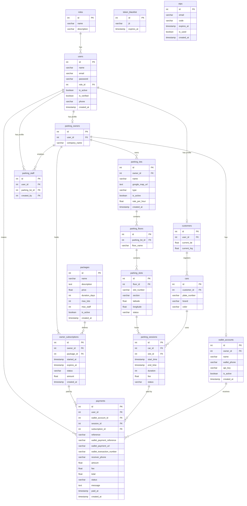
```mermaid
erDiagram
    roles {
        int id PK
        varchar name
        varchar description
    }

    users {
        int id PK
        varchar name
        varchar email
        varchar password
        int role_id FK
        boolean is_active
        boolean is_verified
        varchar phone
        timestamp created_at
    }

    token_blacklist {
        int id PK
        varchar jti
        timestamp expires_at
    }

    otps {
        int id PK
        varchar email
        varchar code
        timestamp expires_at
        boolean is_used
        timestamp created_at
    }

    parking_owners {
        int id PK
        int user_id FK
        varchar company_name
    }

    customers {
        int id PK
        int user_id FK
        float current_lat
        float current_lng
    }

    parking_lots {
        int id PK
        int owner_id FK
        varchar name
        text google_map_url
        varchar type
        boolean is_active
        float rate_per_hour
        timestamp created_at
    }

    parking_staff {
        int id PK
        int user_id FK
        int parking_lot_id FK
        int created_by FK
    }

    cars {
        int id PK
        int customer_id FK
        varchar plate_number
        varchar brand
        varchar color
    }

    parking_floors {
        int id PK
        int parking_lot_id FK
        varchar floor_name
    }

    parking_slots {
        int id PK
        int floor_id FK
        varchar slot_number
        varchar section
        float latitude
        float longitude
        varchar status
    }

    parking_sessions {
        int id PK
        int car_id FK
        int slot_id FK
        timestamp start_time
        timestamp end_time
        int duration
        float fee
        varchar status
    }

    packages {
        int id PK
        varchar name
        text description
        float price
        int duration_days
        int max_lots
        int max_staff
        boolean is_active
        timestamp created_at
    }

    owner_subscriptions {
        int id PK
        int owner_id FK
        int package_id FK
        timestamp started_at
        timestamp expires_at
        varchar status
        float amount
        timestamp created_at
    }

    wallet_accounts {
        int id PK
        int owner_id FK
        varchar name
        varchar wallet_phone
        varchar api_key
        boolean is_active
        timestamp created_at
    }

    payments {
        int id PK
        int user_id FK
        int wallet_account_id FK
        int session_id FK
        int subscription_id FK
        varchar reference
        varchar wallet_payment_reference
        varchar wallet_payment_url
        varchar wallet_transaction_number
        varchar receiver_phone
        float amount
        float fee
        float total
        varchar status
        text message
        timestamp paid_at
        timestamp created_at
    }

    roles ||--o{ users : "has"
    users ||--o| parking_owners : "has profile"
    users ||--o| customers : "has profile"
    users ||--o{ parking_staff : "has profile"
    users ||--o{ payments : "makes"
    parking_owners ||--o{ parking_lots : "owns"
    parking_owners ||--o{ parking_staff : "employs"
    parking_owners ||--o{ owner_subscriptions : "holds"
    parking_owners ||--o| wallet_accounts : "has"
    customers ||--o{ cars : "registers"
    parking_lots ||--o{ parking_floors : "contains"
    parking_floors ||--o{ parking_slots : "contains"
    parking_slots ||--o{ parking_sessions : "hosts"
    cars ||--o{ parking_sessions : "uses"
    packages ||--o{ owner_subscriptions : "defines"
    owner_subscriptions ||--o{ payments : "paid by"
    parking_sessions ||--o{ payments : "paid by"
    wallet_accounts ||--o{ payments : "receives"
```

---

## 2.2 Class Diagram

The class diagram below represents the full domain model of the Smart Parking Lot System backend. It maps directly to the SQLAlchemy ORM models defined under `app/models/`. Each class corresponds to a database table; attributes represent columns; and methods capture the business operations that operate on the entity's state.

### Notation Guide


| Symbol           | Meaning                                                        |
| ---------------- | -------------------------------------------------------------- |
| `+`              | Public member (attribute or method)                            |
| `-->`            | Association / Composition (one class references another)       |
| `"1" --> "0..*"` | Multiplicity — one instance relates to zero-or-more instances |

### Class Descriptions


| Class                 | Layer          | Purpose                                                                                                                | Key Business Rules                                                                                              |
| --------------------- | -------------- | ---------------------------------------------------------------------------------------------------------------------- | --------------------------------------------------------------------------------------------------------------- |
| **Role**              | Auth           | Defines the four platform roles (`ADMIN`, `OWNER`, `STAFF`, `CUSTOMER`). Seeded at startup.                            | Each`User` is assigned exactly one role; role drives all RBAC checks.                                           |
| **User**              | Auth           | Core account entity shared by all roles. Stores credentials and profile.                                               | Password stored as bcrypt hash.`is_verified` must be `true` before login is permitted.                          |
| **ParkingOwner**      | Profile        | Owner-specific profile linked 1-to-1 with a`User`.                                                                     | Must hold an active`OwnerSubscription` to create lots or invite staff.                                          |
| **Customer**          | Profile        | Customer-specific profile linked 1-to-1 with a`User`.                                                                  | Stores optional geolocation (`lat/lng`) for proximity-based lot discovery.                                      |
| **ParkingStaff**      | Profile        | Staff profile linked to both a`User` and a specific `ParkingLot`.                                                      | Staff can only manage sessions belonging to their assigned lot.                                                 |
| **Car**               | Vehicle        | A registered vehicle (plate, brand, colour) belonging to a`Customer`.                                                  | Plate number must be globally unique. A car may not have two overlapping`PENDING`/`ACTIVE` sessions.            |
| **ParkingLot**        | Infrastructure | Top-level parking facility. Contains floors and staff.                                                                 | `is_active` controls customer visibility. `rate_per_hour` drives fee calculation.                               |
| **ParkingFloor**      | Infrastructure | Named floor within a lot (e.g., "Ground", "Level 1").                                                                  | A floor must belong to a lot; deleting a floor cascades to its slots.                                           |
| **ParkingSlot**       | Infrastructure | Individual bookable space on a floor. Tracks`status` (AVAILABLE / OCCUPIED).                                           | A slot may not be double-booked; a 2-hour buffer gap is enforced between consecutive sessions.                  |
| **ParkingSession**    | Session        | Records a booking from`PENDING → ACTIVE → FINISHED`. Tracks start/end times, duration, and computed fee.             | Fee is recalculated at finish time using actual duration ×`rate_per_hour`.                                     |
| **Package**           | Subscription   | Subscription tier defined by Admin (price, duration, lot cap, staff cap).                                              | `is_active=false` hides a package from the owner marketplace without deleting historical subscriptions.         |
| **OwnerSubscription** | Subscription   | Instance of an owner purchasing a package. Tracks`PENDING → ACTIVE` state.                                            | An owner may only have one`ACTIVE` subscription at a time. Lot/staff limits come from the associated `Package`. |
| **WalletAccount**     | Payment        | Digital wallet API credentials (API key, phone) belonging to either Admin (subscription fees) or Owner (session fees). | The API key is used to initiate and confirm two-phase wallet payments.                                          |
| **Payment**           | Payment        | Ledger record for a single completed wallet transaction. Linked to either a`ParkingSession` or an `OwnerSubscription`. | Tracks`PENDING → COMPLETED / FAILED` status and stores the wallet transaction reference for audit.             |


```mermaid
classDiagram
    class Role {
        +int id
        +str name
        +str description
        +list~User~ users
        +get_users() list~User~
        +is_admin() bool
        +is_owner() bool
        +is_staff() bool
        +is_customer() bool
    }

    class User {
        +int id
        +str name
        +str email
        +str password
        +int role_id
        +bool is_active
        +bool is_verified
        +str phone
        +datetime created_at
        +Role role
        +ParkingOwner owner_profile
        +ParkingStaff staff_profile
        +Customer customer_profile
        +list~Payment~ payments
        +verify_password(plain_password) bool
        +hash_password(plain_password) str
        +verify_email() void
        +activate() void
        +deactivate() void
        +get_role_name() str
    }

    class ParkingOwner {
        +int id
        +int user_id
        +str company_name
        +User user
        +list~ParkingLot~ parking_lots
        +list~ParkingStaff~ staff
        +list~OwnerSubscription~ subscriptions
        +WalletAccount wallet_account
        +get_active_subscription() OwnerSubscription
        +can_create_lot() bool
        +can_add_staff() bool
        +get_total_revenue() float
    }

    class Customer {
        +int id
        +int user_id
        +float current_lat
        +float current_lng
        +User user
        +list~Car~ cars
        +get_active_session() ParkingSession
        +get_cars() list~Car~
        +update_location(lat, lng) void
    }

    class ParkingStaff {
        +int id
        +int user_id
        +int parking_lot_id
        +int created_by
        +User user
        +ParkingLot parking_lot
        +get_assigned_lot() ParkingLot
        +can_manage_session(session_id) bool
    }

    class Car {
        +int id
        +int customer_id
        +str plate_number
        +str brand
        +str color
        +Customer customer
        +list~ParkingSession~ sessions
        +is_currently_parked() bool
        +get_session_history() list~ParkingSession~
    }

    class ParkingLot {
        +int id
        +int owner_id
        +str name
        +str google_map_url
        +str type
        +bool is_active
        +float rate_per_hour
        +datetime created_at
        +ParkingOwner owner
        +list~ParkingFloor~ floors
        +list~ParkingStaff~ staff
        +get_total_slots() int
        +get_available_slots() int
        +get_occupancy_rate() float
        +is_open() bool
    }

    class ParkingFloor {
        +int id
        +int parking_lot_id
        +str floor_name
        +ParkingLot parking_lot
        +list~ParkingSlot~ slots
        +get_available_slot_count() int
        +add_slot(slot_number, section) ParkingSlot
    }

    class ParkingSlot {
        +int id
        +int floor_id
        +str slot_number
        +str section
        +float latitude
        +float longitude
        +str status
        +ParkingFloor floor
        +list~ParkingSession~ sessions
        +is_available() bool
        +mark_occupied() void
        +mark_available() void
        +check_schedule_conflict(start, end) bool
    }

    class ParkingSession {
        +int id
        +int car_id
        +int slot_id
        +datetime start_time
        +datetime end_time
        +int duration
        +float fee
        +str status
        +Car car
        +ParkingSlot slot
        +list~Payment~ payments
        +calculate_fee(rate_per_hour) float
        +start_session() void
        +finish_session() void
        +is_active() bool
        +is_conflict(start, end) bool
    }

    class Package {
        +int id
        +str name
        +str description
        +float price
        +int duration_days
        +int max_lots
        +int max_staff
        +bool is_active
        +datetime created_at
        +list~OwnerSubscription~ subscriptions
        +is_valid() bool
        +get_formatted_price() str
    }

    class OwnerSubscription {
        +int id
        +int owner_id
        +int package_id
        +datetime started_at
        +datetime expires_at
        +str status
        +float amount
        +datetime created_at
        +ParkingOwner owner
        +Package package
        +list~Payment~ payments
        +is_active() bool
        +is_expired() bool
        +extend_duration(days) void
    }

    class WalletAccount {
        +int id
        +int owner_id
        +str name
        +str wallet_phone
        +str api_key
        +bool is_active
        +datetime created_at
        +datetime updated_at
        +ParkingOwner owner
        +list~Payment~ payments
        +verify_api_key(key) bool
        +generate_api_key() str
    }

    class Payment {
        +int id
        +int user_id
        +int wallet_account_id
        +int session_id
        +int subscription_id
        +str reference
        +str wallet_payment_reference
        +str wallet_payment_url
        +str wallet_transaction_number
        +str receiver_phone
        +float amount
        +float fee
        +float total
        +str status
        +str message
        +datetime paid_at
        +datetime created_at
        +initiate_payment() str
        +confirm_payment(otp, pin) bool
        +mark_completed() void
        +mark_failed(reason) void
    }

    Role "1" --> "0..*" User
    User "1" --> "0..1" ParkingOwner
    User "1" --> "0..1" Customer
    User "1" --> "0..1" ParkingStaff
    User "1" --> "0..*" Payment
    ParkingOwner "1" --> "0..*" ParkingLot
    ParkingOwner "1" --> "0..*" ParkingStaff
    ParkingOwner "1" --> "0..*" OwnerSubscription
    ParkingOwner "1" --> "0..1" WalletAccount
    Customer "1" --> "0..*" Car
    ParkingLot "1" --> "0..*" ParkingFloor
    ParkingLot "1" --> "0..*" ParkingStaff
    ParkingFloor "1" --> "0..*" ParkingSlot
    ParkingSlot "1" --> "0..*" ParkingSession
    Car "1" --> "0..*" ParkingSession
    Package "1" --> "0..*" OwnerSubscription
    OwnerSubscription "1" --> "0..*" Payment
    ParkingSession "1" --> "0..*" Payment
    WalletAccount "1" --> "0..*" Payment
```

---

## 2.3 Use Case Diagram

The system defines four actors — **System Admin**, **Parking Owner**, **Parking Staff**, and **Customer** — each with a distinct set of permitted actions. The subsections below present standard UML Use Case Diagrams for each role, with an outer **System Boundary** box enclosing oval use cases and explicit `include` / `extend` relationships:

- **Solid line** `---` — Actor association to entry-point use cases.
- **Dashed arrow** `-.->` labelled `include` — mandatory dependency (base use case **always** triggers included use case).
- **Dashed arrow** `-.->` labelled `extend` — optional functionality (extending use case conditionally extends base use case).

### Actor Summary


| Actor             | Description                                                                  | Entry Point                           | Scope of Authority                                                                                                                                   |
| ----------------- | ---------------------------------------------------------------------------- | ------------------------------------- | ---------------------------------------------------------------------------------------------------------------------------------------------------- |
| **System Admin**  | Platform super-user seeded at system startup. Not self-registered.           | Admin Portal login                    | Platform-wide: user management, owner monitoring, subscription packages, wallet configuration, read-only access to all lots, sessions, and payments. |
| **Parking Owner** | Business operator who self-registers and manages parking facilities.         | Owner Portal login after registration | Own resources: lots, floors, slots, staff, subscriptions, and revenue data.                                                                          |
| **Parking Staff** | Operational user assigned to a single lot by the owner.                      | Staff Portal login                    | Single lot: slot board monitoring, session list, and finishing active sessions.                                                                      |
| **Customer**      | End user of the customer-facing app. Self-registers with email verification. | Customer App login after OTP          | Own account: vehicle management, lot discovery, slot booking, wallet payments, and session history.                                                  |

### Relationship Notation


| Notation              | Name            | When To Use                                                                                           |
| --------------------- | --------------- | ----------------------------------------------------------------------------------------------------- |
| Solid actor line`---` | **Association** | Connects an actor to a use case they can directly initiate.                                           |
| Dashed arrow`include` | **Include**     | The source use case**always and unconditionally** triggers the target use case (mandatory sub-flow).  |
| Dashed arrow`extend`  | **Extend**      | The source use case**optionally and conditionally** extends the target use case (optional behaviour). |

---

### 2.3.1 System Admin Use Cases

The System Admin is the platform super-user. Admin accounts are seeded by the system and govern user management, monitoring parking owners, package management, and system-wide settings. Admin users do not register or create parking owner accounts; parking owners self-register.

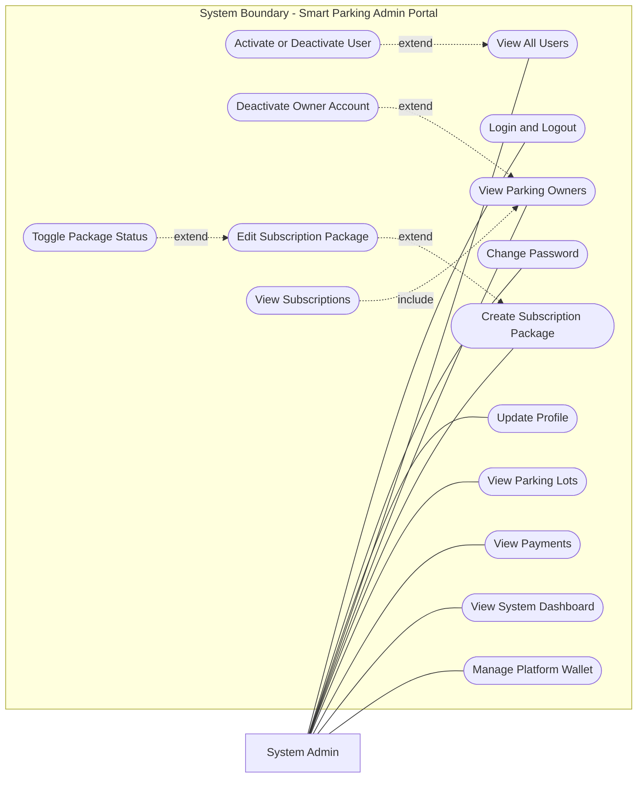
```mermaid
graph LR
    Admin["System Admin"]

    subgraph "System Boundary - Smart Parking Admin Portal"
        A1(["Login and Logout"])
        A2(["Change Password"])
        A3(["Update Profile"])
        B1(["View All Users"])
        B2(["Activate or Deactivate User"])
        C1(["View Parking Owners"])
        C2(["Deactivate Owner Account"])
        D1(["Create Subscription Package"])
        D2(["Edit Subscription Package"])
        D3(["Toggle Package Status"])
        E1(["View Parking Lots"])
        E2(["View Subscriptions"])
        E3(["View Payments"])
        E4(["View System Dashboard"])
        F1(["Manage Platform Wallet"])
    end

    Admin --- A1
    Admin --- A2
    Admin --- A3
    Admin --- B1
    Admin --- C1
    Admin --- D1
    Admin --- E1
    Admin --- E3
    Admin --- E4
    Admin --- F1

    %% include and extend relationships
    E2 -.->|include| C1
    B2 -.->|extend| B1
    C2 -.->|extend| C1
    D2 -.->|extend| D1
    D3 -.->|extend| D2
```


| Use Case                           | Relationship                            | Description                                                                                                        |
| ---------------------------------- | --------------------------------------- | ------------------------------------------------------------------------------------------------------------------ |
| **Login and Logout**               | —                                      | Authenticate using email and password; receive JWT access and refresh tokens. Logout blacklists the refresh token. |
| **Change Password**                | —                                      | Update the account password by providing the current password and a new password.                                  |
| **Update Profile**                 | —                                      | Edit account name and phone number.                                                                                |
| **View All Users**                 | —                                      | Browse and search all registered users across every role on the platform.                                          |
| **Activate or Deactivate User**    | `extend` View All Users                 | Optional action performed while viewing users — toggled without leaving the list view.                            |
| **View All Parking Owners**        | —                                      | List all registered parking owner accounts with their company names and subscription status.                       |
| **Deactivate Owner Account**       | `extend` View All Parking Owners        | Optional suspension action available when viewing an owner's detail record.                                        |
| **Create Subscription Package**    | —                                      | Define a new tiered subscription plan with price, duration, and lot/staff limits.                                  |
| **Edit Subscription Package**      | `extend` Create Subscription Package    | Optional modification of an existing package after it has been created.                                            |
| **Activate or Deactivate Package** | `extend` Edit Subscription Package      | Optional availability toggle, always triggered through the edit flow.                                              |
| **View All Parking Lots**          | —                                      | Read-only platform-wide overview of all registered lots.                                                           |
| **View All Subscriptions**         | `include` View All Parking Owners       | Always displays owner context alongside each subscription record.                                                  |
| **View All Payments**              | —                                      | Audit the complete payment ledger for session fees and subscription purchases.                                     |
| **View System Dashboard**          | —                                      | Aggregated platform statistics: total revenue, active sessions, users, and owner counts.                           |
| **Create Platform Wallet Account** | —                                      | Register the Admin's digital wallet API key that receives subscription fees.                                       |
| **Update Platform Wallet Account** | `extend` Create Platform Wallet Account | Optional rotation of API key or wallet phone after the account has been created.                                   |

---

### 2.3.2 Parking Owner Use Cases

A Parking Owner manages one or more parking facilities on the platform. Parking Owners self-register their accounts. The number of lots and staff they can create is governed by their active subscription package.

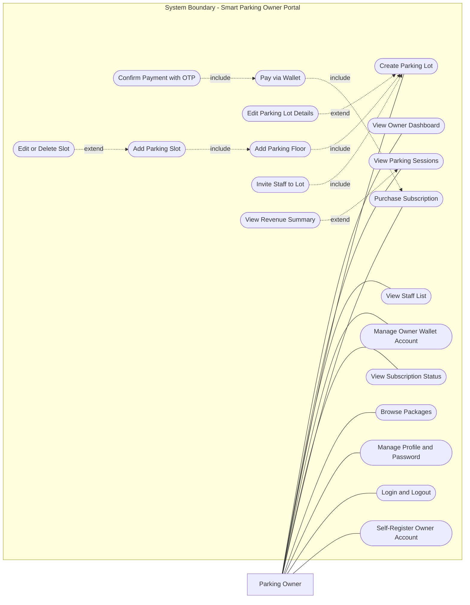
```mermaid
graph LR
    Owner["Parking Owner"]

    subgraph "System Boundary - Smart Parking Owner Portal"
        A0(["Self-Register Owner Account"])
        A1(["Login and Logout"])
        A2(["Manage Profile and Password"])
        B1(["Browse Packages"])
        B2(["Purchase Subscription"])
        B3(["Pay via Wallet"])
        B4(["Confirm Payment with OTP"])
        B5(["View Subscription Status"])
        C1(["Manage Owner Wallet Account"])
        D1(["Create Parking Lot"])
        D2(["Edit Parking Lot Details"])
        D3(["Add Parking Floor"])
        D4(["Add Parking Slot"])
        D5(["Edit or Delete Slot"])
        E1(["Invite Staff to Lot"])
        E2(["View Staff List"])
        F1(["View Parking Sessions"])
        F2(["View Revenue Summary"])
        F3(["View Owner Dashboard"])
    end

    Owner --- A0
    Owner --- A1
    Owner --- A2
    Owner --- B1
    Owner --- B2
    Owner --- B5
    Owner --- C1
    Owner --- D1
    Owner --- E2
    Owner --- F1
    Owner --- F3

    %% include and extend relationships
    B3 -.->|include| B2
    B4 -.->|include| B3
    D3 -.->|include| D1
    D4 -.->|include| D3
    E1 -.->|include| D1
    D2 -.->|extend| D1
    D5 -.->|extend| D4
    F2 -.->|extend| F1
```


| Use Case                                  | Relationship                          | Description                                                                                                 |
| ----------------------------------------- | ------------------------------------- | ----------------------------------------------------------------------------------------------------------- |
| **Self-Register Owner Account**           | —                                    | Register a new owner account directly via`/auth/register-owner` with company details.                       |
| **Login and Logout**                      | —                                    | Authenticate with JWT tokens.                                                                               |
| **Change Password**                       | —                                    | Update account password from the profile settings page.                                                     |
| **Update Profile**                        | —                                    | Edit display name and phone number.                                                                         |
| **Browse Available Packages**             | —                                    | View all active subscription packages with price, duration, and lot/staff limits.                           |
| **Purchase Subscription**                 | —                                    | Initiate a subscription to a chosen package, creating a PENDING subscription record.                        |
| **Pay Subscription via Wallet**           | `include` Purchase Subscription       | Always triggered after initiating a subscription — starts the two-phase wallet payment.                    |
| **Confirm Subscription Payment with OTP** | `include` Pay Subscription via Wallet | Always required to finalise payment — submits OTP and PIN to activate the subscription.                    |
| **View Subscription Status**              | —                                    | Check current expiry date, package tier, and payment history.                                               |
| **Create Owner Wallet Account**           | —                                    | Register the digital wallet API key that receives parking session fees from customers.                      |
| **Update Owner Wallet Account**           | `extend` Create Owner Wallet Account  | Optionally rotate API key or update wallet phone after initial creation.                                    |
| **Create Parking Lot**                    | —                                    | Add a new lot with name, type, hourly rate, and map URL. Requires an active subscription within lot limits. |
| **Edit Parking Lot Details**              | `extend` Create Parking Lot           | Optionally update lot name, rate, map URL, or type after creation.                                          |
| **Activate or Deactivate Lot**            | `extend` Edit Parking Lot Details     | Optionally toggle lot visibility from within the edit flow.                                                 |
| **Add Parking Floor**                     | `include` Create Parking Lot          | Always requires an existing lot — floor cannot exist independently.                                        |
| **Edit or Delete Floor**                  | `extend` Add Parking Floor            | Optionally rename or remove a floor after it has been created.                                              |
| **Add Parking Slot**                      | `include` Add Parking Floor           | Always requires an existing floor — slot cannot exist without a floor.                                     |
| **Edit or Delete Slot**                   | `extend` Add Parking Slot             | Optionally update slot details or remove a slot after creation.                                             |
| **Invite Staff to Lot**                   | `include` Create Parking Lot          | Always requires an existing lot to assign staff to. Respects max_staff subscription limit.                  |
| **Remove Staff from Lot**                 | `extend` View Staff List              | Optionally unlinks a staff member when viewing the staff list.                                              |
| **View Staff List**                       | —                                    | See all staff members assigned to each of the owner's lots.                                                 |
| **View Parking Sessions**                 | —                                    | List all sessions (PENDING, ACTIVE, FINISHED) across the owner's lots.                                      |
| **View Revenue Summary**                  | `extend` View Parking Sessions        | Optional aggregated revenue view triggered from within the sessions page.                                   |
| **View Owner Dashboard**                  | —                                    | Summary cards: active sessions, today's revenue, slot occupancy rate, subscription status.                  |

---

### 2.3.3 Parking Staff Use Cases

Parking Staff are operational users assigned to a specific parking lot by its owner. Their role focuses on day-to-day vehicle management: monitoring slot occupancy and closing out parking sessions when customers exit.

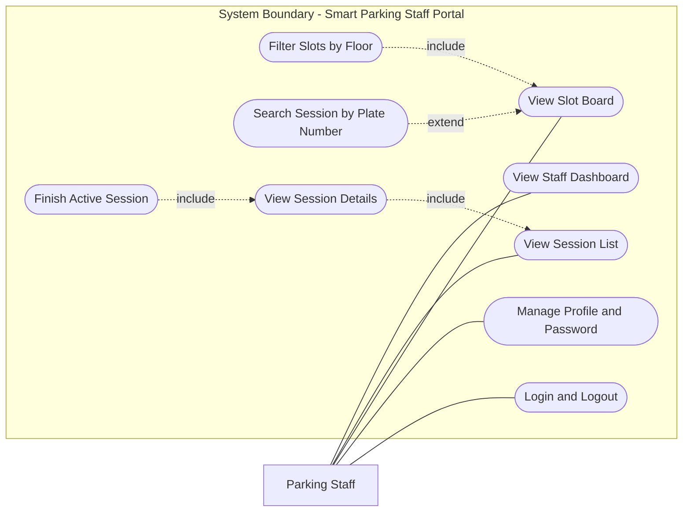
```mermaid
graph LR
    Staff["Parking Staff"]

    subgraph "System Boundary - Smart Parking Staff Portal"
        A1(["Login and Logout"])
        A2(["Manage Profile and Password"])
        B1(["View Slot Board"])
        B2(["Filter Slots by Floor"])
        B3(["Search Session by Plate Number"])
        C1(["View Session List"])
        C2(["View Session Details"])
        C3(["Finish Active Session"])
        D1(["View Staff Dashboard"])
    end

    Staff --- A1
    Staff --- A2
    Staff --- B1
    Staff --- C1
    Staff --- D1

    %% include and extend relationships
    B2 -.->|include| B1
    C2 -.->|include| C1
    C3 -.->|include| C2
    B3 -.->|extend| B1
```


| Use Case                             | Relationship                                                    | Description                                                                                                          |
| ------------------------------------ | --------------------------------------------------------------- | -------------------------------------------------------------------------------------------------------------------- |
| **Login and Logout**                 | —                                                              | Authenticate using credentials created by the Parking Owner.                                                         |
| **Change Password**                  | —                                                              | Update account password via the profile settings page.                                                               |
| **Update Profile**                   | —                                                              | Edit display name and phone number.                                                                                  |
| **View Slot Board for Assigned Lot** | —                                                              | Real-time occupancy grid of all slots across floors for the assigned lot.                                            |
| **View Slot Availability by Floor**  | `include` View Slot Board                                       | Always triggered as part of viewing the slot board — the board is organised by floor tabs.                          |
| **Search Session by Plate Number**   | `extend` View Slot Board                                        | Optional search action available from the slot board to locate a session by plate.                                   |
| **View Session List**                | —                                                              | Browse all sessions visible to this staff member's assigned lot, with status filters.                                |
| **View Session Details**             | `include` View Session List                                     | Always navigated to from the session list — requires a session record to be selected first.                         |
| **Finish Active Parking Session**    | `include` View Session Details · `extend` View Session Details | Always requires viewing session details first; the finish action is then optionally triggered from that detail view. |
| **View Staff Dashboard**             | —                                                              | Summary of active sessions in progress at the assigned lot and any pending actions.                                  |

---

### 2.3.4 Customer Use Cases

Customers are end-users of the parking platform. They self-register, manage vehicles, discover parking lots, book time-window slots, and pay via the integrated digital wallet. The customer-facing application is a separate standalone web app.

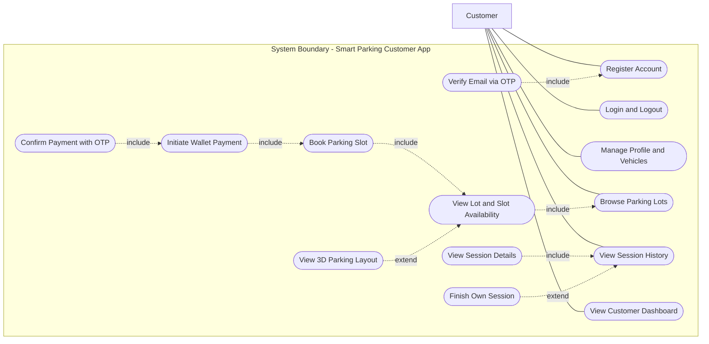
```mermaid
graph LR
    Customer["Customer"]

    subgraph "System Boundary - Smart Parking Customer App"
        A1(["Register Account"])
        A2(["Verify Email via OTP"])
        A3(["Login and Logout"])
        A4(["Manage Profile and Vehicles"])
        B1(["Browse Parking Lots"])
        B2(["View Lot and Slot Availability"])
        B3(["View 3D Parking Layout"])
        C1(["Book Parking Slot"])
        C2(["Initiate Wallet Payment"])
        C3(["Confirm Payment with OTP"])
        D1(["View Session History"])
        D2(["View Session Details"])
        D3(["Finish Own Session"])
        E1(["View Customer Dashboard"])
    end

    Customer --- A1
    Customer --- A3
    Customer --- A4
    Customer --- B1
    Customer --- D1
    Customer --- E1

    %% include and extend relationships
    A2 -.->|include| A1
    B2 -.->|include| B1
    C1 -.->|include| B2
    C2 -.->|include| C1
    C3 -.->|include| C2
    D2 -.->|include| D1
    B3 -.->|extend| B2
    D3 -.->|extend| D1
```


| Use Case                                | Relationship                               | Description                                                                                                     |
| --------------------------------------- | ------------------------------------------ | --------------------------------------------------------------------------------------------------------------- |
| **Register New Account**                | —                                         | Self-register with name, email, and password. Account starts in an unverified state.                            |
| **Verify Email via OTP**                | `include` Register New Account             | Always required immediately after registration — submits the OTP sent to the registered email.                 |
| **Login and Logout**                    | —                                         | Authenticate with email and password. Logout revokes the refresh token.                                         |
| **Change Password**                     | —                                         | Update account password from the profile page.                                                                  |
| **Update Profile**                      | —                                         | Edit display name and phone number.                                                                             |
| **Add Vehicle**                         | —                                         | Register a car with plate number, brand, and colour. Plate must be unique across the platform.                  |
| **Edit Vehicle Details**                | `extend` View Vehicle List                 | Optionally triggered when viewing the vehicle list to update brand or colour.                                   |
| **Delete Vehicle**                      | `extend` View Vehicle List                 | Optionally remove a vehicle from the list. Vehicles with active sessions cannot be deleted.                     |
| **View Vehicle List**                   | —                                         | See all registered cars linked to the customer account.                                                         |
| **Browse Available Parking Lots**       | —                                         | View active PUBLIC parking lots with names, locations, and hourly rates.                                        |
| **View Lot Details and Location**       | `include` Browse Available Parking Lots    | Always navigated to from the lot list — requires a lot to be selected first.                                   |
| **View Floor and Slot Availability**    | `include` View Lot Details and Location    | Always loaded as part of the lot detail page — shows per-floor slot grid.                                      |
| **View 3D Parking Layout**              | `extend` View Floor and Slot Availability  | Optionally switch to an interactive 3D floor view from the slot grid.                                           |
| **View 3D Slot View**                   | `extend` View 3D Parking Layout            | Optionally drill into an immersive 3D view of a single slot from the 3D floor view.                             |
| **Book Parking Slot for Time Window**   | `include` View Floor and Slot Availability | Always triggered from the slot grid — requires a visible AVAILABLE slot to book.                               |
| **Initiate Wallet Payment for Session** | `include` Book Parking Slot                | Always triggered immediately after a booking is created — starts the two-phase wallet payment.                 |
| **Confirm Payment with OTP and PIN**    | `include` Initiate Wallet Payment          | Always required to finalise payment — submits OTP and PIN; on success the session becomes ACTIVE.              |
| **Finish Own Parking Session**          | `extend` View Own Sessions                 | Optionally mark an ACTIVE session as FINISHED from the sessions list, releasing the slot.                       |
| **View Own Sessions**                   | —                                         | Browse all personal sessions with status filters and fee summaries.                                             |
| **View Session Details and Fee**        | `include` View Own Sessions                | Always navigated to from the session list to view the full session record and payment reference.                |
| **View Customer Dashboard**             | —                                         | Summary showing the current active session, recent history, and quick links to browse lots and manage vehicles. |

## 2.4 Sequence Diagram

Each role's core workflows are illustrated below using standard UML sequence diagrams. Actors interact with the system via the **Management App** or **Customer App** (UI), which communicates with the backend **Smart Parking System** and the underlying **Database**, plus external services (Email Service, Payment Gateway) where applicable. Lifelines feature vertical activation bars representing active execution states.

### Participants / Lifelines Legend


| Participant Alias | Full Name                     | Role                                                                                 |
| ----------------- | ----------------------------- | ------------------------------------------------------------------------------------ |
| **UI**            | Management App / Customer App | Frontend application that renders user interface forms and sends API requests.       |
| **System**        | Smart Parking System          | Backend application service handling authentication, validation, and business rules. |
| **DB**            | Database                      | Relational database (PostgreSQL) storing system entities and persistent state.       |
| **Email**         | Email Service                 | External SMTP email provider used for sending OTP verification codes.                |
| **Wallet**        | Payment Gateway               | External digital wallet API used for two-phase payment processing.                   |

### Lifeline Notation


| Symbol                    | Meaning                                                                  |
| ------------------------- | ------------------------------------------------------------------------ |
| `activate` / `deactivate` | Vertical activation bar showing when a lifeline is processing a request. |
| `->>`                     | Synchronous message call (request).                                      |
| `-->>`                    | Return message (response).                                               |

---

## 2.4.1 System Admin Sequence Diagrams

### 2.4.1.1 Admin Login

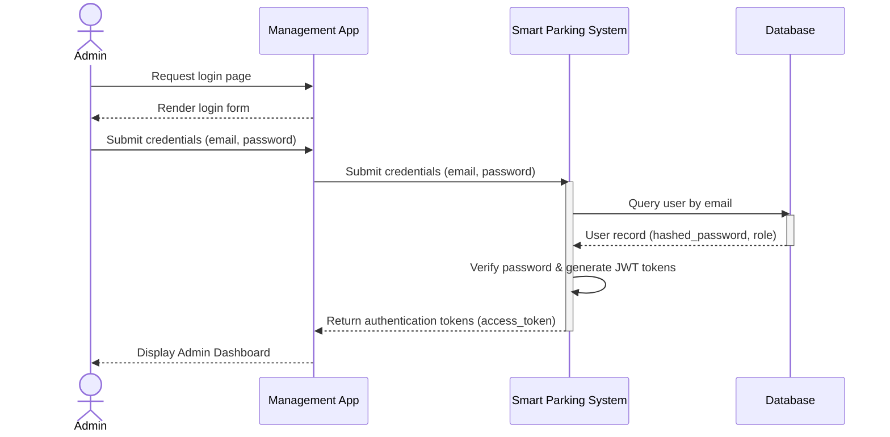
```mermaid
sequenceDiagram
    actor Admin
    participant UI as Management App
    participant System as Smart Parking System
    participant DB as Database

    Admin->>UI: Request login page
    UI-->>Admin: Render login form
    Admin->>UI: Submit credentials (email, password)
    UI->>System: Submit credentials (email, password)
    activate System
    System->>DB: Query user by email
    activate DB
    DB-->>System: User record (hashed_password, role)
    deactivate DB
    System->>System: Verify password & generate JWT tokens
    System-->>UI: Return authentication tokens (access_token)
    deactivate System
    UI-->>Admin: Display Admin Dashboard
```

#### Step-by-Step Description


| Step | From → To   | Message / Operation              | Description                                                      |
| ---- | ------------ | -------------------------------- | ---------------------------------------------------------------- |
| 1    | Admin → UI  | Request login page               | Admin opens the Management App login page.                       |
| 2    | UI → Admin  | Render login form                | UI presents the email and password input form.                   |
| 3    | Admin → UI  | Submit credentials               | Admin enters credentials and clicks Sign In.                     |
| 4    | UI → System | `Submit credentials`             | UI sends login credentials payload to the backend.               |
| 5    | System → DB | `Query user by email`            | System fetches user account details from the database.           |
| 6    | DB → System | `User record`                    | Database returns hashed password and assigned role.              |
| 7    | System       | `Verify password & generate JWT` | System checks bcrypt hash and generates JWT token pair on match. |
| 8    | System → UI | `Return authentication tokens`   | System returns access and refresh tokens to the client.          |
| 9    | UI → Admin  | Display Admin Dashboard          | UI saves token and redirects Admin to dashboard view.            |

---

### 2.4.1.2 Create and Manage a Subscription Package

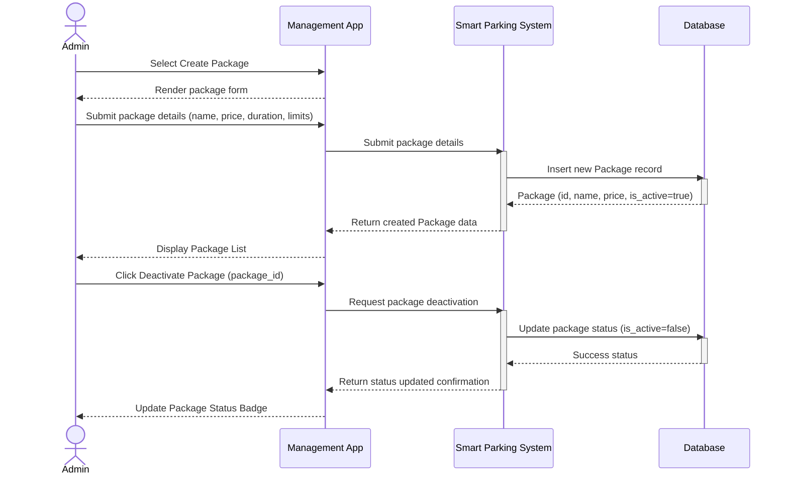
```mermaid
sequenceDiagram
    actor Admin
    participant UI as Management App
    participant System as Smart Parking System
    participant DB as Database

    Admin->>UI: Select Create Package
    UI-->>Admin: Render package form
    Admin->>UI: Submit package details (name, price, duration, limits)
    UI->>System: Submit package details
    activate System
    System->>DB: Insert new Package record
    activate DB
    DB-->>System: Package (id, name, price, is_active=true)
    deactivate DB
    System-->>UI: Return created Package data
    deactivate System
    UI-->>Admin: Display Package List

    Admin->>UI: Click Deactivate Package (package_id)
    UI->>System: Request package deactivation
    activate System
    System->>DB: Update package status (is_active=false)
    activate DB
    DB-->>System: Success status
    deactivate DB
    System-->>UI: Return status updated confirmation
    deactivate System
    UI-->>Admin: Update Package Status Badge
```

#### Step-by-Step Description


| Step | From → To   | Message / Operation                  | Description                                                     |
| ---- | ------------ | ------------------------------------ | --------------------------------------------------------------- |
| 1    | Admin → UI  | Select Create Package                | Admin navigates to Package Management and clicks "New Package". |
| 2    | Admin → UI  | Submit package details               | Admin inputs package name, price, duration, and limit caps.     |
| 3    | UI → System | `Submit package details`             | UI sends new package data to the System backend.                |
| 4    | System → DB | `Insert new Package record`          | System stores new package record (`is_active=true`).            |
| 5    | DB → System | `Package record`                     | Database returns created package record.                        |
| 6    | System → UI | `Return created Package data`        | System sends success response with created package.             |
| 7    | UI → Admin  | Display Package List                 | UI updates table with the new package entry.                    |
| 8    | Admin → UI  | Click Deactivate Package             | Admin selects an active package and clicks Deactivate.          |
| 9    | UI → System | `Request package deactivation`       | UI sends deactivation request for the package ID.               |
| 10   | System → DB | `Update package status`              | System sets`is_active = false` in the database.                 |
| 11   | DB → System | `Success status`                     | Database confirms update.                                       |
| 12   | System → UI | `Return status updated confirmation` | System responds with updated package state.                     |
| 13   | UI → Admin  | Update Package Status Badge          | UI updates package badge to show Inactive.                      |

---

### 2.4.1.3 Deactivate a Parking Owner Account

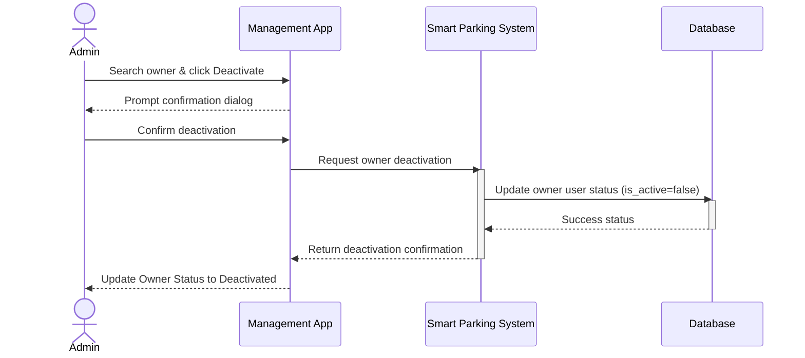
```mermaid
sequenceDiagram
    actor Admin
    participant UI as Management App
    participant System as Smart Parking System
    participant DB as Database

    Admin->>UI: Search owner & click Deactivate
    UI-->>Admin: Prompt confirmation dialog
    Admin->>UI: Confirm deactivation
    UI->>System: Request owner deactivation
    activate System
    System->>DB: Update owner user status (is_active=false)
    activate DB
    DB-->>System: Success status
    deactivate DB
    System-->>UI: Return deactivation confirmation
    deactivate System
    UI-->>Admin: Update Owner Status to Deactivated
```

#### Step-by-Step Description


| Step | From → To   | Message / Operation                | Description                                                        |
| ---- | ------------ | ---------------------------------- | ------------------------------------------------------------------ |
| 1    | Admin → UI  | Search owner & click Deactivate    | Admin selects an owner from list and clicks Deactivate.            |
| 2    | UI → Admin  | Prompt confirmation dialog         | UI displays confirmation modal to prevent accidental deactivation. |
| 3    | Admin → UI  | Confirm deactivation               | Admin confirms the action in modal.                                |
| 4    | UI → System | `Request owner deactivation`       | UI sends deactivation request to System backend.                   |
| 5    | System → DB | `Update owner user status`         | System sets target user account`is_active = false`.                |
| 6    | DB → System | `Success status`                   | Database confirms status change.                                   |
| 7    | System → UI | `Return deactivation confirmation` | System returns success response to UI.                             |
| 8    | UI → Admin  | Update Owner Status                | UI updates owner status badge to Deactivated.                      |

---

## 2.4.2 Parking Owner Sequence Diagrams

### 2.4.2.1 Owner Self-Registration

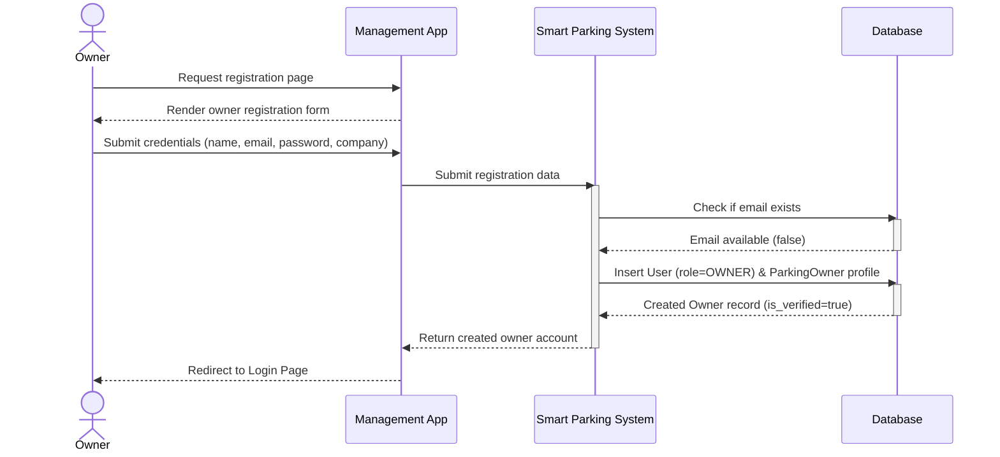
```mermaid
sequenceDiagram
    actor Owner
    participant UI as Management App
    participant System as Smart Parking System
    participant DB as Database

    Owner->>UI: Request registration page
    UI-->>Owner: Render owner registration form
    Owner->>UI: Submit credentials (name, email, password, company)
    UI->>System: Submit registration data
    activate System
    System->>DB: Check if email exists
    activate DB
    DB-->>System: Email available (false)
    deactivate DB
    System->>DB: Insert User (role=OWNER) & ParkingOwner profile
    activate DB
    DB-->>System: Created Owner record (is_verified=true)
    deactivate DB
    System-->>UI: Return created owner account
    deactivate System
    UI-->>Owner: Redirect to Login Page
```

#### Step-by-Step Description


| Step | From → To   | Message / Operation            | Description                                                               |
| ---- | ------------ | ------------------------------ | ------------------------------------------------------------------------- |
| 1    | Owner → UI  | Request registration page      | Owner opens the Owner Registration URL (unprotected endpoint).            |
| 2    | UI → Owner  | Render owner registration form | UI renders the registration form fields.                                  |
| 3    | Owner → UI  | Submit credentials             | Owner enters registration data and submits.                               |
| 4    | UI → System | `Submit registration data`     | UI sends registration payload to System endpoint.                         |
| 5    | System → DB | `Check if email exists`        | System checks database for existing email.                                |
| 6    | DB → System | `Email available`              | Database confirms email is unique.                                        |
| 7    | System → DB | `Insert User & ParkingOwner`   | System creates User (`role=OWNER`, `is_verified=true`) and Owner profile. |
| 8    | DB → System | `Created Owner record`         | Database returns saved account data.                                      |
| 9    | System → UI | `Return created owner account` | System sends success response.                                            |
| 10   | UI → Owner  | Redirect to Login Page         | UI directs Owner to login page.                                           |

---

### 2.4.2.2 Create a Parking Lot with Floors and Slots

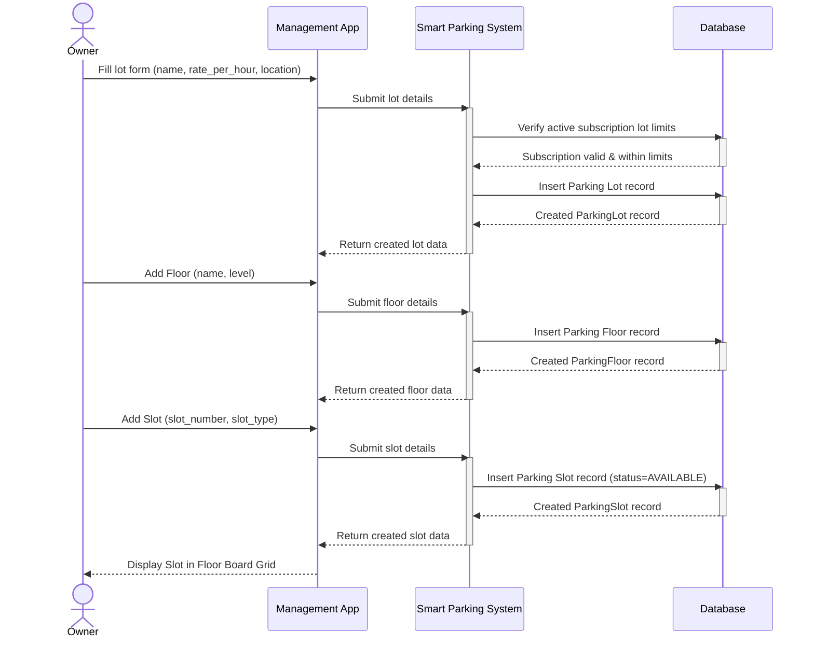
```mermaid
sequenceDiagram
    actor Owner
    participant UI as Management App
    participant System as Smart Parking System
    participant DB as Database

    Owner->>UI: Fill lot form (name, rate_per_hour, location)
    UI->>System: Submit lot details
    activate System
    System->>DB: Verify active subscription lot limits
    activate DB
    DB-->>System: Subscription valid & within limits
    deactivate DB
    System->>DB: Insert Parking Lot record
    activate DB
    DB-->>System: Created ParkingLot record
    deactivate DB
    System-->>UI: Return created lot data
    deactivate System

    Owner->>UI: Add Floor (name, level)
    UI->>System: Submit floor details
    activate System
    System->>DB: Insert Parking Floor record
    activate DB
    DB-->>System: Created ParkingFloor record
    deactivate DB
    System-->>UI: Return created floor data
    deactivate System

    Owner->>UI: Add Slot (slot_number, slot_type)
    UI->>System: Submit slot details
    activate System
    System->>DB: Insert Parking Slot record (status=AVAILABLE)
    activate DB
    DB-->>System: Created ParkingSlot record
    deactivate DB
    System-->>UI: Return created slot data
    deactivate System
    UI-->>Owner: Display Slot in Floor Board Grid
```

#### Step-by-Step Description


| Step | From → To   | Message / Operation          | Description                                              |
| ---- | ------------ | ---------------------------- | -------------------------------------------------------- |
| 1    | Owner → UI  | Fill lot form                | Owner fills in lot name, hourly rate, and facility type. |
| 2    | UI → System | `Submit lot details`         | UI sends lot creation request.                           |
| 3    | System → DB | `Verify subscription limits` | System checks DB to enforce package`max_lots` limit.     |
| 4    | DB → System | `Limits valid`               | Database confirms owner is within package allowance.     |
| 5    | System → DB | `Insert Parking Lot`         | System persists the new`ParkingLot` entity.              |
| 6    | System → UI | `Return created lot data`    | System returns newly created lot data.                   |
| 7    | Owner → UI  | Add Floor                    | Owner enters floor name and level number.                |
| 8    | UI → System | `Submit floor details`       | UI sends floor creation payload.                         |
| 9    | System → DB | `Insert Parking Floor`       | System persists floor linked to lot.                     |
| 10   | System → UI | `Return created floor data`  | System returns floor object to UI.                       |
| 11   | Owner → UI  | Add Slot                     | Owner specifies slot identifier and category.            |
| 12   | UI → System | `Submit slot details`        | UI sends slot creation payload.                          |
| 13   | System → DB | `Insert Parking Slot`        | System persists slot with initial status`AVAILABLE`.     |
| 14   | System → UI | `Return created slot data`   | System returns slot data to UI.                          |
| 15   | UI → Owner  | Display Slot Board           | UI renders updated slot grid.                            |

---

### 2.4.2.3 Subscription Purchase and Wallet Payment

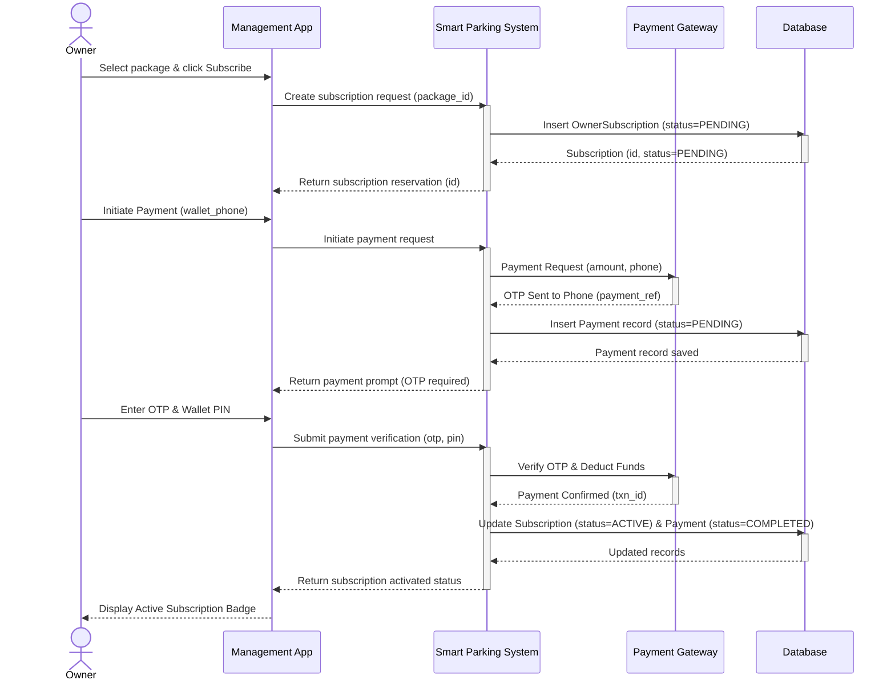
```mermaid
sequenceDiagram
    actor Owner
    participant UI as Management App
    participant System as Smart Parking System
    participant Wallet as Payment Gateway
    participant DB as Database

    Owner->>UI: Select package & click Subscribe
    UI->>System: Create subscription request (package_id)
    activate System
    System->>DB: Insert OwnerSubscription (status=PENDING)
    activate DB
    DB-->>System: Subscription (id, status=PENDING)
    deactivate DB
    System-->>UI: Return subscription reservation (id)
    deactivate System

    Owner->>UI: Initiate Payment (wallet_phone)
    UI->>System: Initiate payment request
    activate System
    System->>Wallet: Payment Request (amount, phone)
    activate Wallet
    Wallet-->>System: OTP Sent to Phone (payment_ref)
    deactivate Wallet
    System->>DB: Insert Payment record (status=PENDING)
    activate DB
    DB-->>System: Payment record saved
    deactivate DB
    System-->>UI: Return payment prompt (OTP required)
    deactivate System

    Owner->>UI: Enter OTP & Wallet PIN
    UI->>System: Submit payment verification (otp, pin)
    activate System
    System->>Wallet: Verify OTP & Deduct Funds
    activate Wallet
    Wallet-->>System: Payment Confirmed (txn_id)
    deactivate Wallet
    System->>DB: Update Subscription (status=ACTIVE) & Payment (status=COMPLETED)
    activate DB
    DB-->>System: Updated records
    deactivate DB
    System-->>UI: Return subscription activated status
    deactivate System
    UI-->>Owner: Display Active Subscription Badge
```

#### Step-by-Step Description


| Step | From → To       | Message / Operation                    | Description                                                     |
| ---- | ---------------- | -------------------------------------- | --------------------------------------------------------------- |
| 1    | Owner → UI      | Select package & Subscribe             | Owner picks a subscription package.                             |
| 2    | UI → System     | `Create subscription request`          | UI requests subscription creation.                              |
| 3    | System → DB     | `Insert OwnerSubscription`             | System creates pending subscription record in DB.               |
| 4    | System → UI     | `Return subscription reservation`      | System returns subscription ID.                                 |
| 5    | Owner → UI      | Initiate Payment                       | Owner enters wallet phone number and starts checkout.           |
| 6    | UI → System     | `Initiate payment request`             | UI sends payment initiation call.                               |
| 7    | System → Wallet | `Payment Request`                      | System initiates payment request via digital wallet gateway.    |
| 8    | Wallet → System | `OTP Sent`                             | Gateway dispatches SMS OTP code to owner's phone.               |
| 9    | System → DB     | `Insert Payment`                       | System logs pending Payment record in DB.                       |
| 10   | System → UI     | `Return payment prompt`                | System instructs UI to display OTP entry modal.                 |
| 11   | Owner → UI      | Enter OTP & PIN                        | Owner types OTP and security PIN.                               |
| 12   | UI → System     | `Submit payment verification`          | UI submits payment verification call.                           |
| 13   | System → Wallet | `Verify OTP & Deduct`                  | System validates OTP with wallet gateway to execute transfer.   |
| 14   | Wallet → System | `Payment Confirmed`                    | Gateway confirms fund transfer with transaction ID.             |
| 15   | System → DB     | `Update Subscription & Payment`        | System sets subscription to`ACTIVE` and payment to `COMPLETED`. |
| 16   | System → UI     | `Return subscription activated status` | System responds with activated subscription details.            |
| 17   | UI → Owner      | Display Active Subscription            | UI shows active subscription badge and tier quota.              |

---

## 2.4.3 Parking Staff Sequence Diagrams

### 2.4.3.1 View Slot Board and Search Session by Plate Number

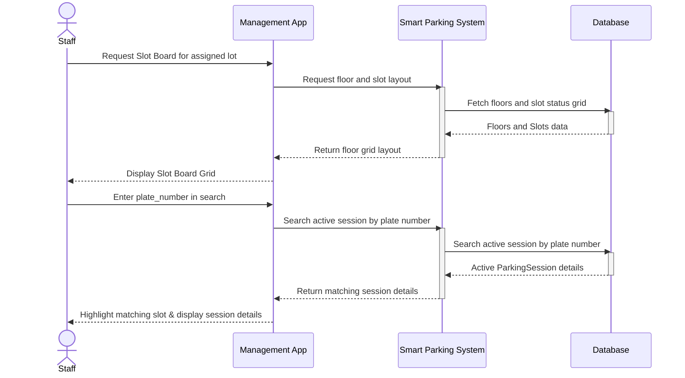
```mermaid
sequenceDiagram
    actor Staff
    participant UI as Management App
    participant System as Smart Parking System
    participant DB as Database

    Staff->>UI: Request Slot Board for assigned lot
    UI->>System: Request floor and slot layout
    activate System
    System->>DB: Fetch floors and slot status grid
    activate DB
    DB-->>System: Floors and Slots data
    deactivate DB
    System-->>UI: Return floor grid layout
    deactivate System
    UI-->>Staff: Display Slot Board Grid

    Staff->>UI: Enter plate_number in search
    UI->>System: Search active session by plate number
    activate System
    System->>DB: Search active session by plate number
    activate DB
    DB-->>System: Active ParkingSession details
    deactivate DB
    System-->>UI: Return matching session details
    deactivate System
    UI-->>Staff: Highlight matching slot & display session details
```

#### Step-by-Step Description


| Step | From → To   | Message / Operation               | Description                                                  |
| ---- | ------------ | --------------------------------- | ------------------------------------------------------------ |
| 1    | Staff → UI  | Request Slot Board                | Staff opens the Slot Board for assigned lot.                 |
| 2    | UI → System | `Request floor and slot layout`   | UI requests floor and slot structure.                        |
| 3    | System → DB | `Fetch floors and slots`          | System retrieves floors and slots with current availability. |
| 4    | DB → System | `Floors and Slots data`           | Database returns current floor grid data.                    |
| 5    | System → UI | `Return floor grid layout`        | System responds with grid details.                           |
| 6    | UI → Staff  | Display Slot Board Grid           | UI renders slot grid (green=AVAILABLE, red=OCCUPIED).        |
| 7    | Staff → UI  | Enter plate_number in search      | Staff types vehicle plate number.                            |
| 8    | UI → System | `Search active session by plate`  | UI requests active session matching plate.                   |
| 9    | System → DB | `Search active session`           | System queries database for active session.                  |
| 10   | DB → System | `ParkingSession details`          | Database returns active session info with car details.       |
| 11   | System → UI | `Return matching session details` | System returns session detail object.                        |
| 12   | UI → Staff  | Highlight matching slot           | UI highlights target slot in grid and shows session popover. |

---

### 2.4.3.2 Finish an Active Parking Session

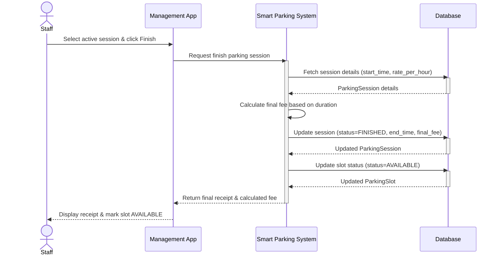
```mermaid
sequenceDiagram
    actor Staff
    participant UI as Management App
    participant System as Smart Parking System
    participant DB as Database

    Staff->>UI: Select active session & click Finish
    UI->>System: Request finish parking session
    activate System
    System->>DB: Fetch session details (start_time, rate_per_hour)
    activate DB
    DB-->>System: ParkingSession details
    deactivate DB
    System->>System: Calculate final fee based on duration
    System->>DB: Update session (status=FINISHED, end_time, final_fee)
    activate DB
    DB-->>System: Updated ParkingSession
    deactivate DB
    System->>DB: Update slot status (status=AVAILABLE)
    activate DB
    DB-->>System: Updated ParkingSlot
    deactivate DB
    System-->>UI: Return final receipt & calculated fee
    deactivate System
    UI-->>Staff: Display receipt & mark slot AVAILABLE
```

#### Step-by-Step Description


| Step | From → To   | Message / Operation                     | Description                                                                  |
| ---- | ------------ | --------------------------------------- | ---------------------------------------------------------------------------- |
| 1    | Staff → UI  | Select session & click Finish           | Staff locates vehicle session and triggers checkout.                         |
| 2    | UI → System | `Request finish parking session`        | UI sends request to finish session.                                          |
| 3    | System → DB | `Fetch session details`                 | System retrieves start time and lot hourly rate.                             |
| 4    | DB → System | `ParkingSession details`                | Database returns session record.                                             |
| 5    | System       | `Calculate final fee`                   | System calculates total duration and final fee (`ceil(hours) × rate`).      |
| 6    | System → DB | `Update session`                        | System updates session status to`FINISHED` with end timestamp and final fee. |
| 7    | System → DB | `Update slot status`                    | System sets parking slot status back to`AVAILABLE`.                          |
| 8    | System → UI | `Return final receipt & calculated fee` | System returns session receipt payload.                                      |
| 9    | UI → Staff  | Display receipt & mark slot AVAILABLE   | UI shows final receipt and updates slot color to green on board.             |

---

## 2.4.4 Customer Sequence Diagrams

### 2.4.4.1 Customer Registration and Email Verification

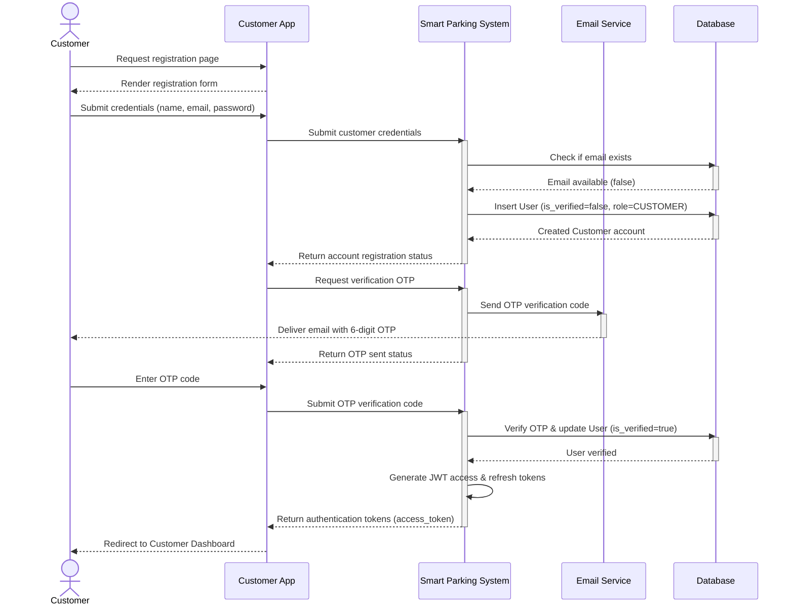
```mermaid
sequenceDiagram
    actor Customer
    participant UI as Customer App
    participant System as Smart Parking System
    participant Email as Email Service
    participant DB as Database

    Customer->>UI: Request registration page
    UI-->>Customer: Render registration form
    Customer->>UI: Submit credentials (name, email, password)
    UI->>System: Submit customer credentials
    activate System
    System->>DB: Check if email exists
    activate DB
    DB-->>System: Email available (false)
    deactivate DB
    System->>DB: Insert User (is_verified=false, role=CUSTOMER)
    activate DB
    DB-->>System: Created Customer account
    deactivate DB
    System-->>UI: Return account registration status
    deactivate System

    UI->>System: Request verification OTP
    activate System
    System->>Email: Send OTP verification code
    activate Email
    Email-->>Customer: Deliver email with 6-digit OTP
    deactivate Email
    System-->>UI: Return OTP sent status
    deactivate System

    Customer->>UI: Enter OTP code
    UI->>System: Submit OTP verification code
    activate System
    System->>DB: Verify OTP & update User (is_verified=true)
    activate DB
    DB-->>System: User verified
    deactivate DB
    System->>System: Generate JWT access & refresh tokens
    System-->>UI: Return authentication tokens (access_token)
    deactivate System
    UI-->>Customer: Redirect to Customer Dashboard
```

#### Step-by-Step Description


| Step | From → To        | Message / Operation                  | Description                                                  |
| ---- | ----------------- | ------------------------------------ | ------------------------------------------------------------ |
| 1    | Customer → UI    | Request registration page            | Customer opens Customer App signup screen.                   |
| 2    | UI → Customer    | Render registration form             | UI presents registration fields.                             |
| 3    | Customer → UI    | Submit credentials                   | Customer submits account details.                            |
| 4    | UI → System      | `Submit customer credentials`        | UI posts registration payload.                               |
| 5    | System → DB      | `Check if email exists`              | System verifies email is unique.                             |
| 6    | DB → System      | `Email available`                    | Database confirms email is not taken.                        |
| 7    | System → DB      | `Insert User`                        | System creates User record with`is_verified=false`.          |
| 8    | System → UI      | `Return account registration status` | System returns created account payload.                      |
| 9    | UI → System      | `Request verification OTP`           | UI requests OTP verification code.                           |
| 10   | System → Email   | `Send OTP code`                      | System sends 6-digit OTP via Email Service.                  |
| 11   | Email → Customer | Deliver OTP                          | Email Service delivers verification email to Customer inbox. |
| 12   | System → UI      | `Return OTP sent status`             | System responds that OTP has been sent.                      |
| 13   | Customer → UI    | Enter OTP code                       | Customer submits OTP received via email.                     |
| 14   | UI → System      | `Submit OTP verification code`       | UI posts OTP verification request.                           |
| 15   | System → DB      | `Update User status`                 | System marks user`is_verified=true` in DB.                   |
| 16   | System            | `Generate JWT tokens`                | System generates JWT access and refresh tokens.              |
| 17   | System → UI      | `Return authentication tokens`       | System returns JWT token pair.                               |
| 18   | UI → Customer    | Display Dashboard                    | UI stores tokens and redirects Customer to dashboard.        |

---

### 2.4.4.2 Book Parking Slot and Complete Wallet Payment

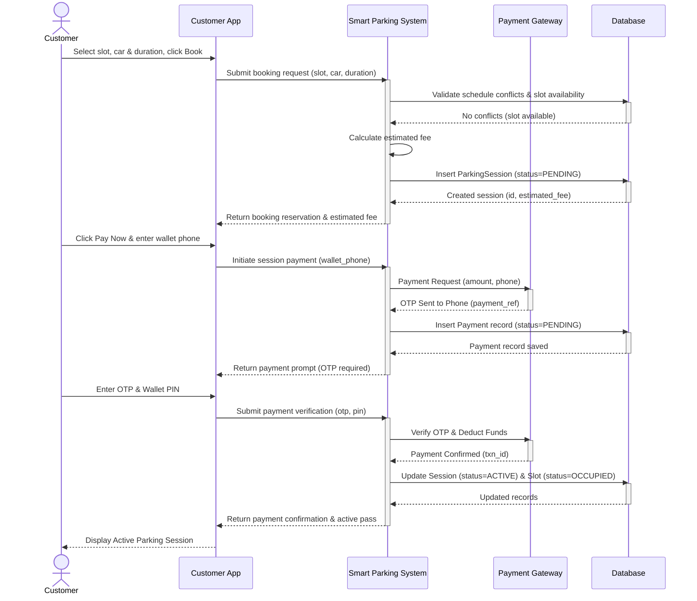
```mermaid
sequenceDiagram
    actor Customer
    participant UI as Customer App
    participant System as Smart Parking System
    participant Wallet as Payment Gateway
    participant DB as Database

    Customer->>UI: Select slot, car & duration, click Book
    UI->>System: Submit booking request (slot, car, duration)
    activate System
    System->>DB: Validate schedule conflicts & slot availability
    activate DB
    DB-->>System: No conflicts (slot available)
    deactivate DB
    System->>System: Calculate estimated fee
    System->>DB: Insert ParkingSession (status=PENDING)
    activate DB
    DB-->>System: Created session (id, estimated_fee)
    deactivate DB
    System-->>UI: Return booking reservation & estimated fee
    deactivate System

    Customer->>UI: Click Pay Now & enter wallet phone
    UI->>System: Initiate session payment (wallet_phone)
    activate System
    System->>Wallet: Payment Request (amount, phone)
    activate Wallet
    Wallet-->>System: OTP Sent to Phone (payment_ref)
    deactivate Wallet
    System->>DB: Insert Payment record (status=PENDING)
    activate DB
    DB-->>System: Payment record saved
    deactivate DB
    System-->>UI: Return payment prompt (OTP required)
    deactivate System

    Customer->>UI: Enter OTP & Wallet PIN
    UI->>System: Submit payment verification (otp, pin)
    activate System
    System->>Wallet: Verify OTP & Deduct Funds
    activate Wallet
    Wallet-->>System: Payment Confirmed (txn_id)
    deactivate Wallet
    System->>DB: Update Session (status=ACTIVE) & Slot (status=OCCUPIED)
    activate DB
    DB-->>System: Updated records
    deactivate DB
    System-->>UI: Return payment confirmation & active pass
    deactivate System
    UI-->>Customer: Display Active Parking Session
```

#### Step-by-Step Description


| Step | From → To       | Message / Operation            | Description                                                                  |
| ---- | ---------------- | ------------------------------ | ---------------------------------------------------------------------------- |
| 1    | Customer → UI   | Select slot, car & duration    | Customer selects slot, vehicle, and start/end time.                          |
| 2    | UI → System     | `Submit booking request`       | UI sends booking reservation call.                                           |
| 3    | System → DB     | `Validate schedule conflicts`  | System checks DB for slot overlap or car double-booking (2-hour buffer gap). |
| 4    | DB → System     | `No conflicts`                 | Database confirms schedule is available.                                     |
| 5    | System           | `Calculate estimated fee`      | System calculates estimated fee based on slot hourly rate.                   |
| 6    | System → DB     | `Insert ParkingSession`        | System saves pending session record.                                         |
| 7    | System → UI     | `Return booking reservation`   | System returns session ID and estimated fee.                                 |
| 8    | Customer → UI   | Enter wallet phone & click Pay | Customer inputs wallet phone number.                                         |
| 9    | UI → System     | `Initiate session payment`     | UI sends payment initiation request.                                         |
| 10   | System → Wallet | `Payment Request`              | System initiates payment request via Payment Gateway.                        |
| 11   | Wallet → System | `OTP Sent`                     | Gateway dispatches SMS OTP code to Customer's phone.                         |
| 12   | System → DB     | `Insert Payment`               | System logs pending Payment record.                                          |
| 13   | System → UI     | `Return payment prompt`        | System instructs UI to show OTP and PIN prompt.                              |
| 14   | Customer → UI   | Enter OTP & PIN                | Customer inputs received OTP and wallet PIN.                                 |
| 15   | UI → System     | `Submit payment verification`  | UI sends payment confirmation call.                                          |
| 16   | System → Wallet | `Verify OTP & Deduct`          | Gateway validates OTP and deducts funds.                                     |
| 17   | Wallet → System | `Payment Confirmed`            | Gateway returns transaction confirmation.                                    |
| 18   | System → DB     | `Update Session & Slot`        | System sets session to`ACTIVE` and slot status to `OCCUPIED`.                |
| 19   | System → UI     | `Return payment confirmation`  | System sends success response.                                               |
| 20   | UI → Customer   | Display Active Session         | UI displays active booking pass and receipt.                                 |

---

# Chapter 3 — Project Implementation

## 3.1 Architecture Overview

The system follows a **layered architecture** on the backend, separating concerns cleanly across four layers:

```
HTTP Request
    ↓
API Layer (app/api/v1/*.py)            — Route definitions, request parsing, auth dependency injection
    ↓
Service Layer (app/services/*.py)      — Business logic, validation rules, orchestration
    ↓
Repository Layer (app/repositories/*.py) — Database queries, pagination helpers
    ↓
Model Layer (app/models/*.py)          — SQLAlchemy ORM class definitions (table schema)
    ↓
Database (PostgreSQL)
```

Request/response data crosses layer boundaries as **Pydantic schemas** (`app/schemas/*.py`), which validate types, enforce constraints, and provide serialisation/deserialisation without coupling the service layer to ORM model internals.

---

## 3.2 Backend Implementation (`smart-parking-api`)

### Project Structure

```
smart-parking-api/
├── app/
│   ├── api/v1/          # API route handlers (one file per resource)
│   │   ├── auth.py
│   │   ├── parking_lot.py
│   │   ├── parking_session.py
│   │   ├── wallet_payment.py
│   │   └── ...          # 16 router files total
│   ├── config/          # Settings (env var loading via Pydantic BaseSettings)
│   ├── core/            # Constants (enums), custom exceptions, logging config
│   ├── database/        # SQLAlchemy engine, session factory, declarative Base
│   ├── dependencies/    # FastAPI dependency providers (auth, pagination)
│   ├── middleware/      # CORS, exception handlers, request logging
│   ├── models/          # SQLAlchemy ORM models (17 models)
│   ├── repositories/    # Data-access objects with pagination support
│   ├── schemas/         # Pydantic v2 request/response schemas
│   ├── services/        # Business logic services (19 service files)
│   └── utils/           # Utility helpers
├── migrations/          # Alembic migration files
├── scripts/             # Seed script (roles, packages, users, lots)
├── tests/               # Pytest test suite
├── table-design.sql     # Reference SQL DDL
└── requirements.txt
```

### Key Implementation Details

#### Authentication & Security

- JWT access tokens (short-lived) and refresh tokens (long-lived) are issued on login/OTP verification.
- On logout, the refresh token's `jti` (JWT ID) is stored in the `token_blacklist` table. A cleanup sweep on startup removes expired blacklist entries.
- Passwords are hashed using **bcrypt** via `passlib`. Plain-text passwords are never stored.
- The `get_current_user` FastAPI dependency decodes and validates the bearer token on every protected endpoint.

#### Session Booking & Fee Calculation

The `ParkingSessionService.book_session()` method enforces:

1. Only `CUSTOMER` role users can book.
2. Car must belong to the booking customer.
3. Slot must exist.
4. Start time must be in the future; end time must be after start time.
5. No scheduling conflict with the same car (active or pending sessions).
6. No scheduling conflict with the same slot (with a mandatory **2-hour buffer gap** before and after existing bookings).
7. Fee = `ceil(duration_minutes / 60) × rate_per_hour`.

The session is created in `PENDING` state and transitions to `ACTIVE` only upon successful wallet payment confirmation.

#### Digital Wallet Integration

The `WalletPaymentClient` (`app/services/wallet_payment_client.py`) encapsulates all communication with the external digital wallet backend. It uses an `X-API-Key` (stored per `WalletAccount`) to authenticate requests. The payment flow is:

- **Initiate**: The API calls the wallet backend to create a payment request. The wallet sends an OTP to the customer's registered phone.
- **Confirm**: The customer submits the OTP and PIN to the Smart Parking API, which forwards them to the wallet backend. On success, the wallet returns a transaction number.

The `Payment` record tracks both the internal reference (`PP-XXXXXX`) and the external wallet references throughout this flow.

#### Subscription Enforcement

Before an owner can create a new parking lot, `ParkingLotService` checks the owner's active subscription against the package's `max_lots` limit. Similarly, `ParkingStaffService` checks the `max_staff` limit before adding staff to a lot.

---

## 3.3 System Implementation Walkthrough

This section provides a visual walkthrough of the running system. Each sub-section corresponds to a distinct role or user flow. A **screenshot placeholder** (`📸`) marks where an actual system screenshot should be inserted once the system is running.

> [!NOTE] 💡
> To capture screenshots: run docker-compose up locally (or access the cloud deployment), navigate to each page, and embed the image file in place of the placeholder comment.

---

## 3.3.1 Customer Application (`smart-parking-customer`)

The Customer App is a standalone React web application (port `3000` locally). It is the primary touchpoint for end-users who register, browse parking lots, book a slot, and pay via digital wallet.

---

### 3.3.1.1 Register Page

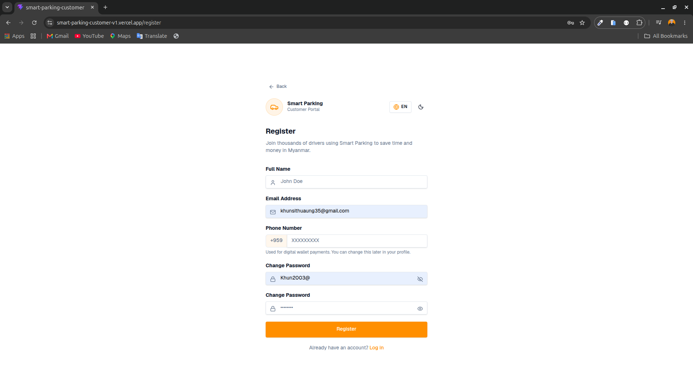

**How it works:**

The Register page displays a multi-field form:

- **Full Name**, **Email Address**, **Password**, **Confirm Password**

When the customer clicks **"Register"**:

1. Client-side validation runs via **React Hook Form + Zod**.
2. A `POST /api/v1/auth/register` request is sent.
3. On success, the customer is redirected to the Email Verification page and an OTP is dispatched to their inbox.

> All seed accounts use the password: `asdffdsa`

---

### 3.3.1.2 Email Verification Page

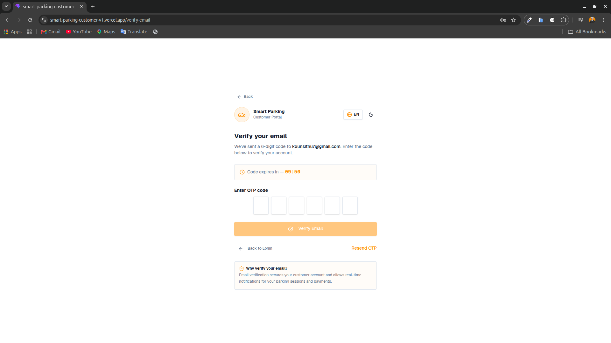

**How it works:**

After registration, the customer must verify their email before logging in:

- **6-digit OTP input** — Code received via email.
- **Countdown timer** — 10-minute validity window.
- **"Resend OTP" button** — Active after the timer expires.

On valid OTP submission, `User.is_verified` is set to `true`, JWT tokens are generated, and the customer is redirected to the Dashboard.

---

### 3.3.1.3 Login Page

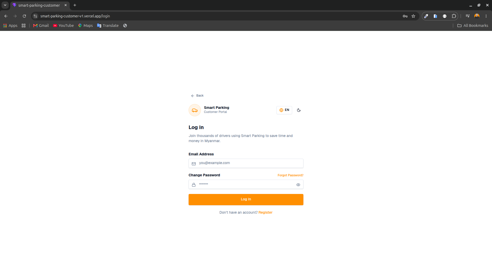

**How it works:**

The Login page accepts **Email** and **Password**. On success:

1. The backend verifies credentials and checks `is_verified = true` and `is_active = true`.
2. JWT access and refresh tokens are returned and persisted in **Zustand** (`localStorage`).
3. The customer is redirected to the Dashboard.

**Seed customer credentials (password:** `asdffdsa`**):**


| Email                         | Registered Cars                             |
| ----------------------------- | ------------------------------------------- |
| `khunsithuaung35@gmail.com`   | Toyota Silver, Nissan Black                 |
| `nainglin.customer@gmail.com` | Honda White, Suzuki Red                     |
| `phyowai.customer@gmail.com`  | Mitsubishi Black, Toyota Gold, Honda Silver |

---

### 3.3.1.4 Customer Dashboard

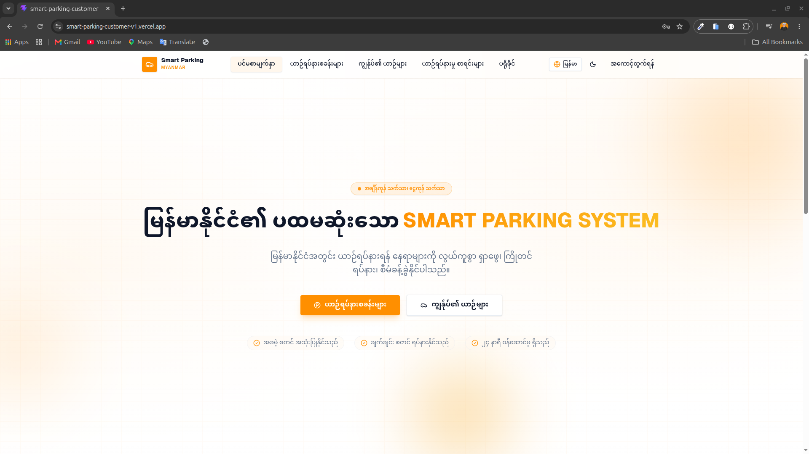

**What it shows:**

- **Active Session Card** — If parked, shows slot number, lot name, start time, elapsed duration, and a "Finish Session" shortcut.
- **Quick Action Buttons** — Browse Lots, My Cars, My Sessions.
- **Recent Sessions** — Compact history list.

If no active session exists, a prompt is shown to browse and book a lot.

---

### 3.3.1.5 Browse Parking Lots

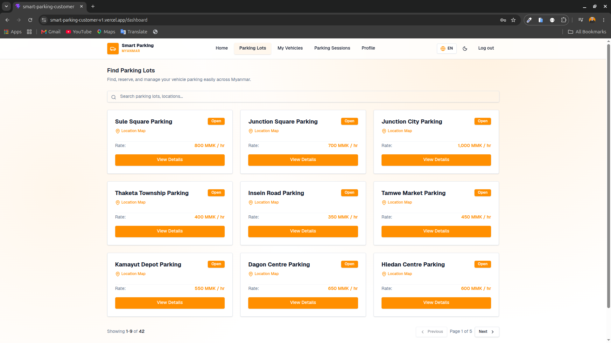

**What it shows:**

All **active** and **publicly visible** parking lots. Each card displays:

- Lot Name, Type (PUBLIC / PRIVATE), Hourly Rate, Available Slots count

Clicking a card navigates to the Lot Detail page.

---

### 3.3.1.6 Parking Lot Detail & Slot Availability

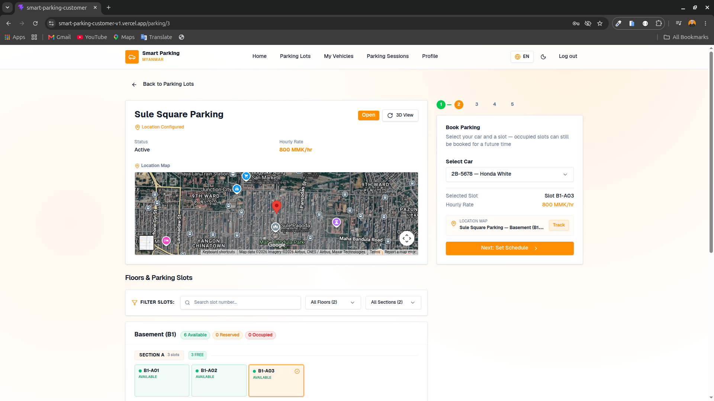

**What it shows:**

- **Lot header** — Name, type, hourly rate, embedded Google Maps frame.
- **Floor Tabs** — One tab per floor. Clicking a tab switches the slot grid.
- **Slot Grid** — Color-coded cards:
  - 🟢 **Green** = `AVAILABLE` (clickable → opens Booking Dialog)
  - 🔴 **Red** = `OCCUPIED` (not bookable)
- **"3D View" button** — Switches to the interactive Three.js 3D layout.

---

### 3.3.1.7 Booking Dialog

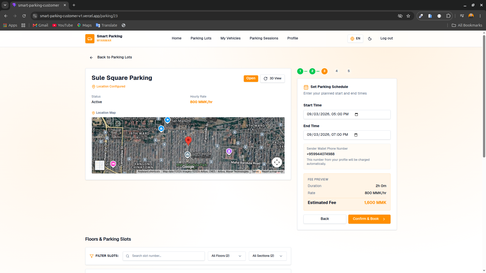

**How it works:**

Clicking an AVAILABLE slot opens a modal with:

- Slot info (read-only), **Select Vehicle** dropdown, **Start / End Date-Time** pickers, **Estimated Fee** (auto-calculated in real time).

On **"Confirm Booking"**:

1. System checks for car and slot conflicts (including the 2-hour buffer gap rule).
2. A `PENDING` parking session is created.
3. The payment modal opens immediately.

---

### 3.3.1.8 About Us Page

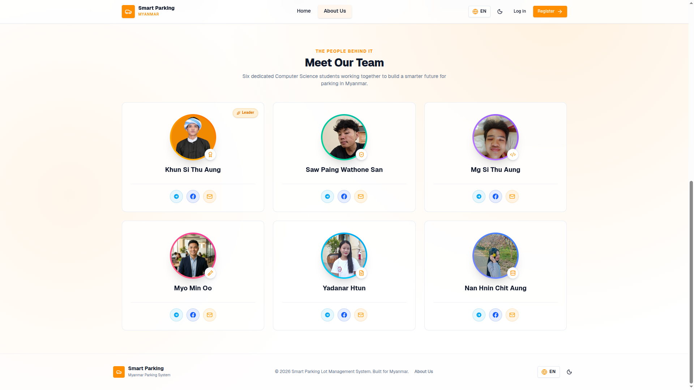

**What it shows:**

The About Us page is publicly accessible (no login required) and introduces the team behind the Smart Parking Lot Management System. It includes:

- **Hero Section** — A full-width banner with the project title, a Computer Science Capstone badge, and a Myanmar location tagline.
- **Platform Statistics** — Animated counters displaying Team Members (6), Weeks of Development (12+), Features Built (20+), and API Endpoints (30+).
- **Mission, Vision & Team Values** — Three cards outlining the project's core purpose and the team's engineering commitment.
- **Team Member Cards** — Profile photo, name, role title, and social link icons (Telegram, Facebook, Email) for all 6 team members:
  - Khun Si Thu Aung — Team Leader & Full Stack Developer
  - Saw Paing Wathone San — QA Engineer & System Analyst
  - Mg Si Thu Aung — Backend Developer
  - Myo Min Oo — QA Engineer & Systems Tester
  - Yadanar Htun — Documentation Lead
  - Nan Hnin Chit Aung — Database Designer & Analyst
- **Tech Stack Highlights** — Badges for React, TypeScript, FastAPI, PostgreSQL, Docker, Nginx.
- **Contact Section** — Email, Telegram channel, and Facebook page links.

**Navigation:**

- Accessible from the **Navbar** ("About Us" link — visible to both logged-in and guest users).
- Accessible from the **Footer** via a direct "About Us" text link.
- Route: `/about` — no authentication required.

---

### 3.3.1. Wallet Payment — OTP Confirmation

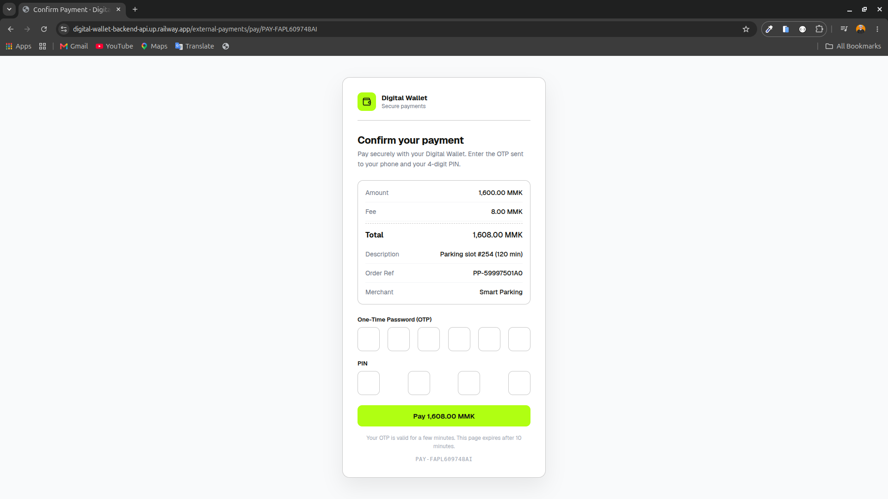

**How it works:**

The confirmation modal requests the **OTP** (received via SMS) and the customer's **wallet PIN**. On **"Confirm Payment"**:

1. System forwards OTP + PIN to the wallet gateway.
2. Gateway validates and deducts the amount.
3. Session status: `PENDING → ACTIVE`; Slot status: `AVAILABLE → OCCUPIED`.
4. Customer sees a success message and is redirected to Sessions.

---

### 3.3.1.10 3D Parking Layout View

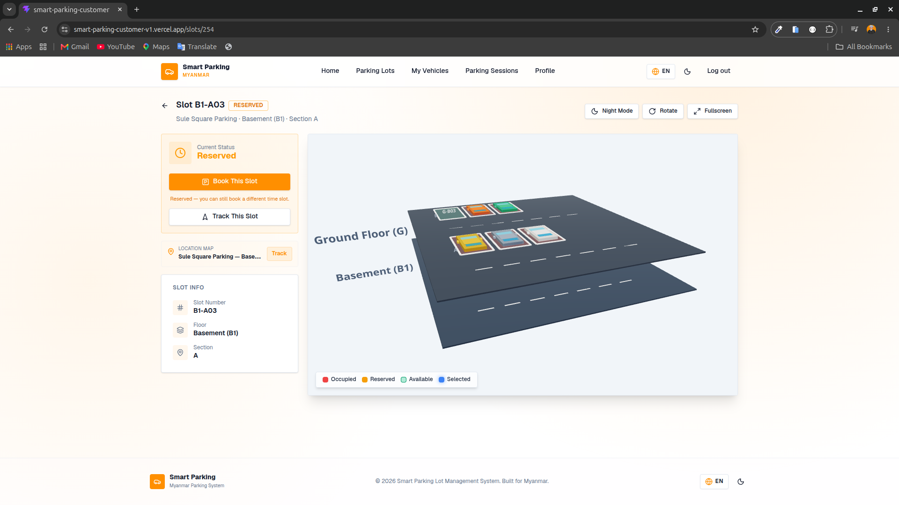

**What it shows:**

An interactive Three.js 3D floor map. Each slot is rendered as a coloured block:

- 🟢 Green = Available, 🔴 Red = Occupied

The customer can rotate/pan the scene (mouse drag or touch), click a slot block to view details and book, or switch back to the 2D grid.

---

### 3.3.1.11 My Cars (Vehicle Management)

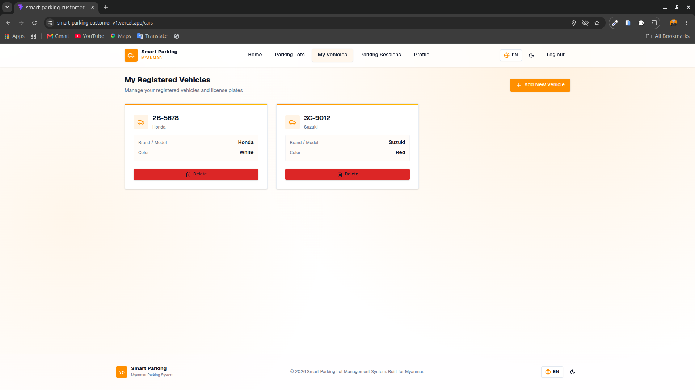

**What it shows:**

All registered vehicles. Each card shows **Plate Number**, **Brand**, **Color**.

Actions available:

- **Add** a new car (plate must be globally unique).
- **Edit** brand or color.
- **Delete** a car (blocked if it has active/pending sessions).

---

### 3.3.1.12 My Sessions (Session History)

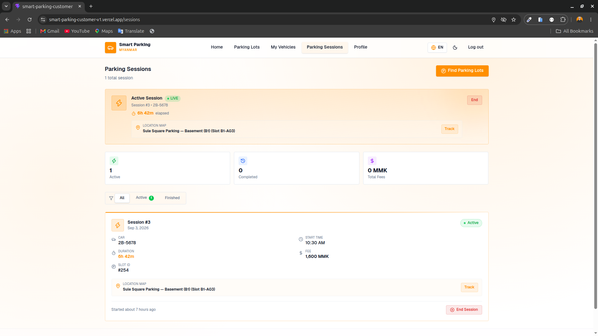

**What it shows:**

All personal parking sessions. Each entry shows Lot, Slot, Start/End, Duration, Fee, and a **Status Badge** (`PENDING` / `ACTIVE` / `FINISHED`).

Actions available:

- Filter by status.
- Click a session to view full details and payment reference.
- **Finish** an `ACTIVE` session (releases the slot).

---

### 3.3.1.13 Profile Page

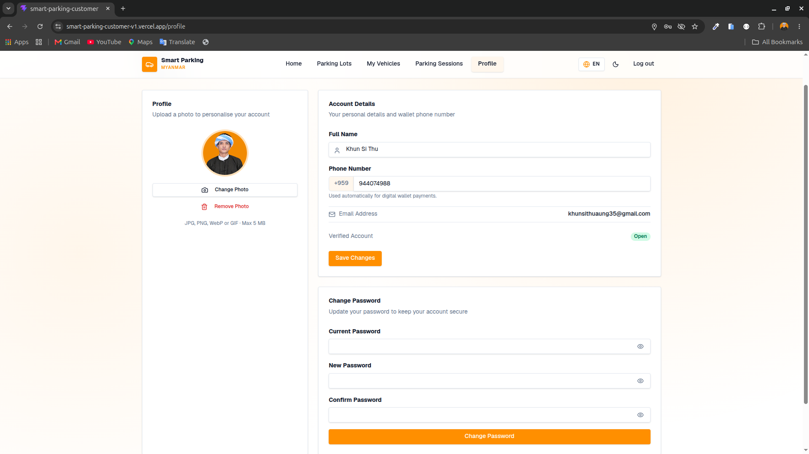

**What it shows:**

- **Update Profile** — Edit name and phone number.
- **Change Password** — Requires current password before updating.
- **Account Info** — Registered email (read-only) and join date.

---

## 3.3.2 Management Portal — Admin Role (`smart-parking-management`)

The Management Portal (port `3001` locally) is a shared React application. After login, the sidebar and pages adapt to the authenticated role.

---

### 3.3.2.1 Admin Login

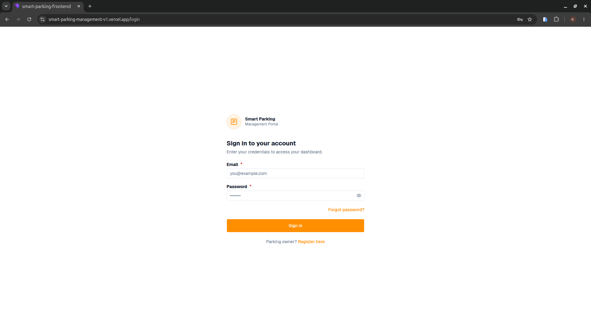

**How to log in:**

The login form (shared across Admin, Owner, and Staff roles) accepts **Email** and **Password**. The system reads the role from the JWT and redirects to the appropriate dashboard.

**Admin seed credentials:**


| Email                    | Password   |
| ------------------------ | ---------- |
| `khunsithu350@gmail.com` | `asdffdsa` |

---

### 3.3.2.2 Admin Dashboard

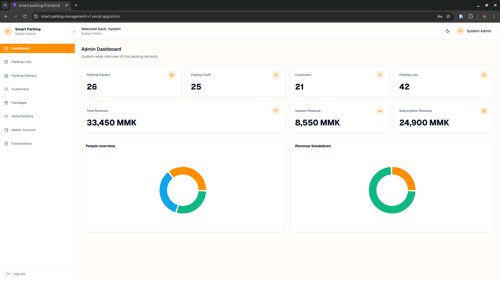

**What it shows:**

Platform-wide summary cards and charts:

- Total Users, Total Owners, Total Parking Lots, Active Sessions
- Revenue chart (bar/line) showing payment volume over time
- Subscription count (active vs. expired)

---

### 3.3.2.3 User Management

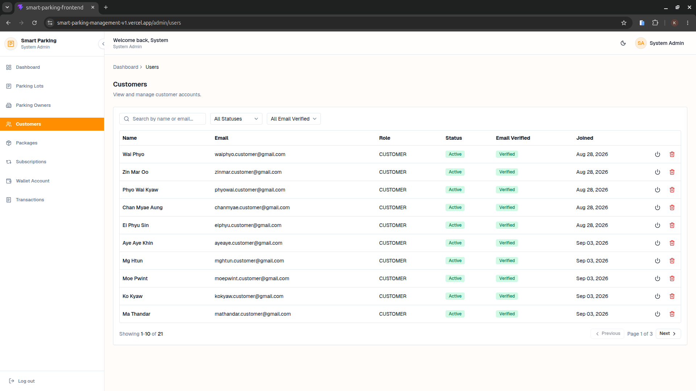

**What it shows:**

A searchable, paginated table with columns: Name, Email, Role, Status (Active/Inactive), Verified, Joined Date.

Actions:

- Search/filter by role.
- **Activate / Deactivate** user — Toggles `is_active`; deactivated users cannot log in.

---

### 3.3.2.4 Parking Owner Management

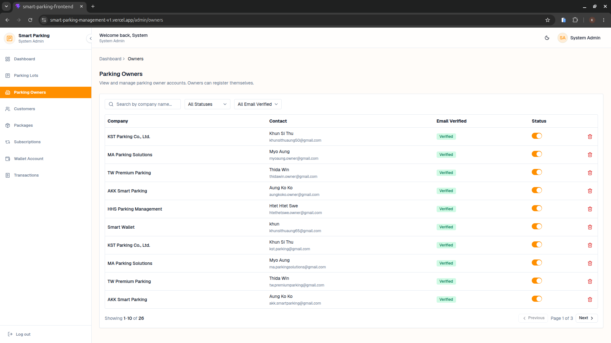

**What it shows:**

All registered parking owners with: Owner Name, Company Name, Email, Subscription Status, Account Status.

Actions:

- View subscription details (package tier, expiry).
- **Deactivate** an owner account.

---

### 3.3.2.5 Subscription Package Management

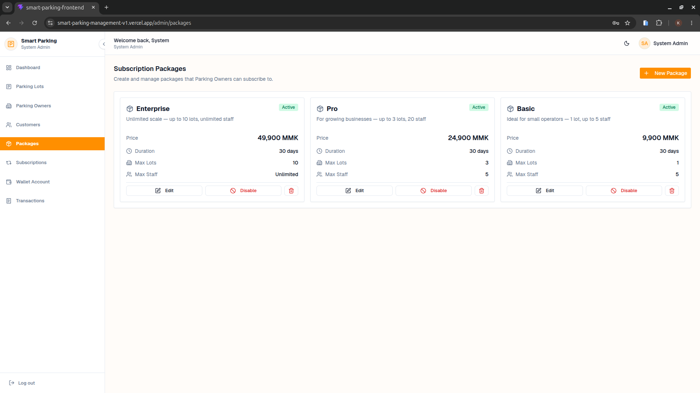

**What it shows:**

All tiered subscription packages with: Name, Price, Duration (days), Max Lots, Max Staff, Status (Active/Inactive).

Actions:

- **Create** a new package.
- **Edit** existing package details.
- **Toggle status** — Inactive packages are hidden from the owner marketplace.

**Seed packages:**


| Package    | Price (MMK/month) | Max Lots | Max Staff |
| ---------- | ----------------- | -------- | --------- |
| Basic      | 9,900             | 1        | 5         |
| Pro        | 24,900            | 3        | 20        |
| Enterprise | 49,900            | 10       | 999       |

---

### 3.3.2.6 All Parking Lots (Read-Only)

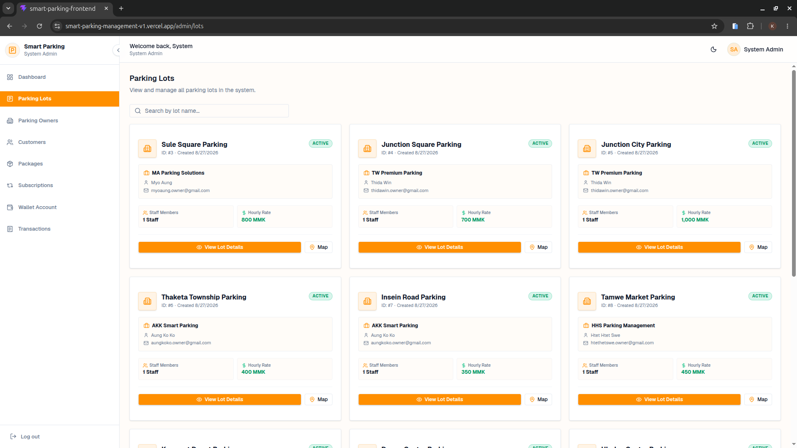

**What it shows:**

A read-only platform-wide table of all lots: Lot Name, Owner / Company, Type, Rate/Hour, Total Slots, Active Status.

The Admin cannot modify lot settings — that is the owner's responsibility.

---

### 3.3.2.7 Payments Overview

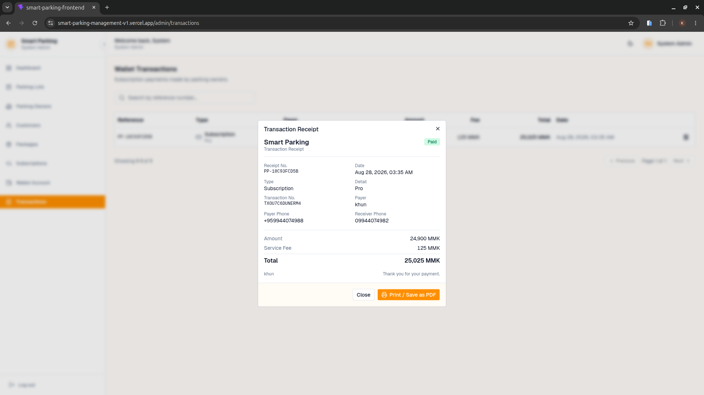

**What it shows:**

A complete payment audit log: Reference (`PP-XXXXXX`), User, Type (Session / Subscription), Amount, Status, Paid At.

Filterable by `PENDING`, `COMPLETED`, or `FAILED`.

---

### 3.3.2.8 Platform Wallet Account

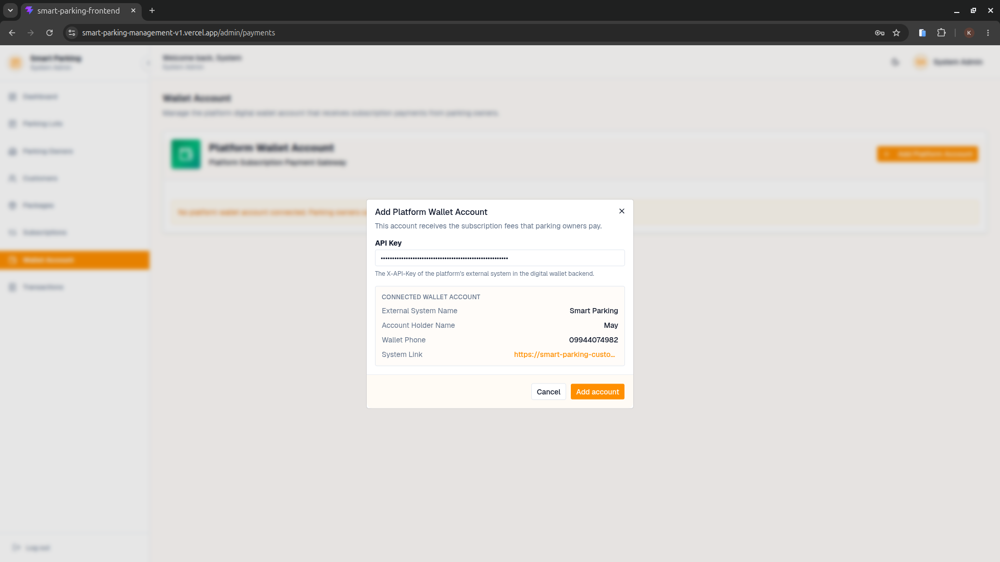

**What it shows:**

Configuration form for the Admin's platform-level wallet (receives subscription fees from owners):

- Wallet Name, Wallet Phone Number, API Key

This account is separate from each owner's individual wallet (which receives session fees from customers).

---

## 3.3.3 Management Portal — Owner Role

After logging in as an Owner, the sidebar shows: Dashboard, My Lots, Subscriptions, Wallet, Staff, Sessions.

**Owner seed credentials (company-name email format, password:** `asdffdsa`**):**


| Email                           | Company               | Package    |
| ------------------------------- | --------------------- | ---------- |
| `kst.parking@gmail.com`         | KST Parking Co., Ltd. | Pro        |
| `tw.premiumparking@gmail.com`   | TW Premium Parking    | Enterprise |
| `akk.smartparking@gmail.com`    | AKK Smart Parking     | Pro        |
| `ma.parkingsolutions@gmail.com` | MA Parking Solutions  | Basic      |

---

### 3.3.3.1 Owner Dashboard

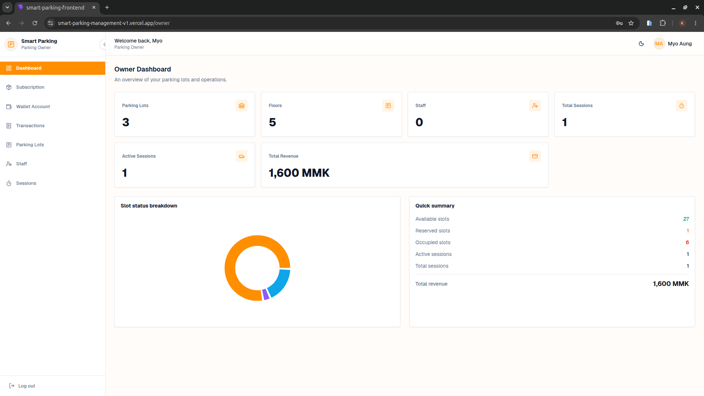

**What it shows:**

- Active Sessions across all owned lots
- Today's Revenue total
- Slot Occupancy Rate (%)
- Subscription status: package tier, expiry date, remaining lot/staff quota

---

### 3.3.3.2 Subscription Purchase

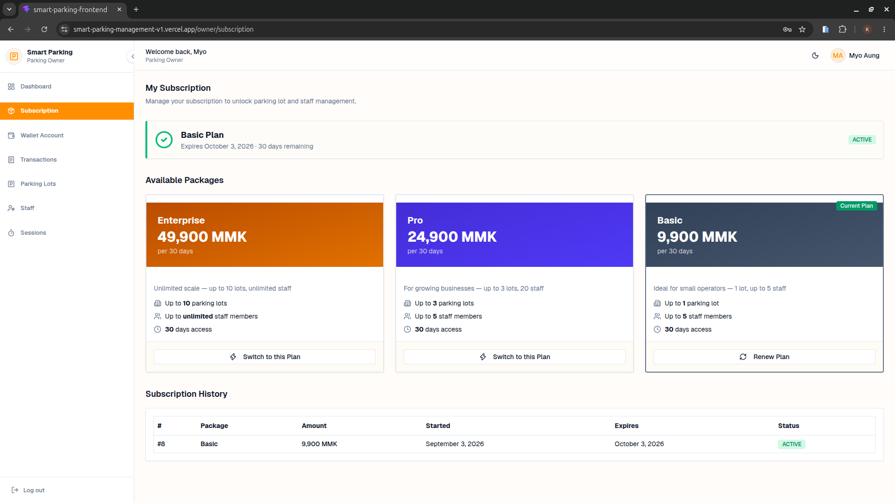

**How it works:**

Available packages are shown as cards. To purchase:

1. Click **"Subscribe"** on the desired package.
2. Enter wallet phone number in the payment dialog.
3. Wallet sends an OTP; enter OTP + wallet PIN.
4. On success: subscription becomes `ACTIVE`, lot/staff quotas unlocked.

---

### 3.3.3.3 Create & Manage Parking Lots

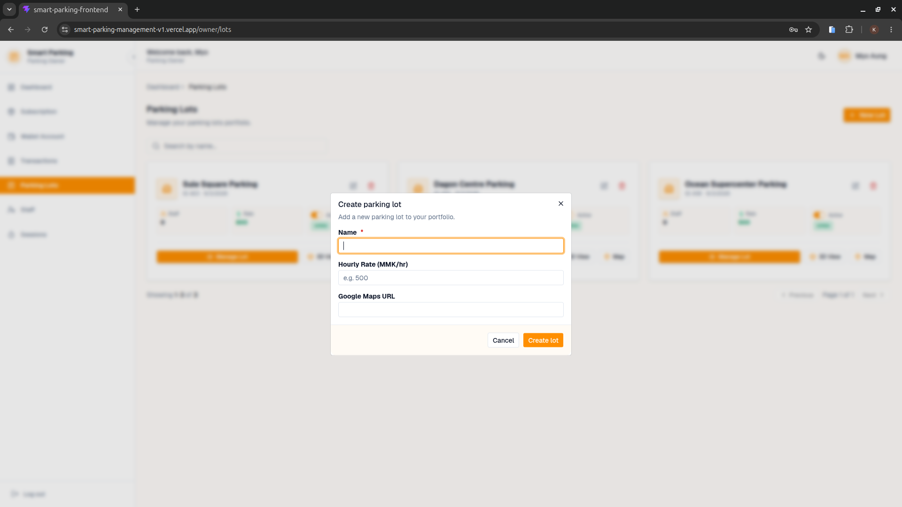

**What it shows:**

All owned lots: Name, Type, Rate/Hour, Total Slots, Active Status.

Actions:

- **Create** a new lot (blocked if `max_lots` subscription limit reached).
- **Edit** lot name, rate, map URL, or toggle active/inactive.

---

### 3.3.3.4 Lot Detail — Floors & Slots Management

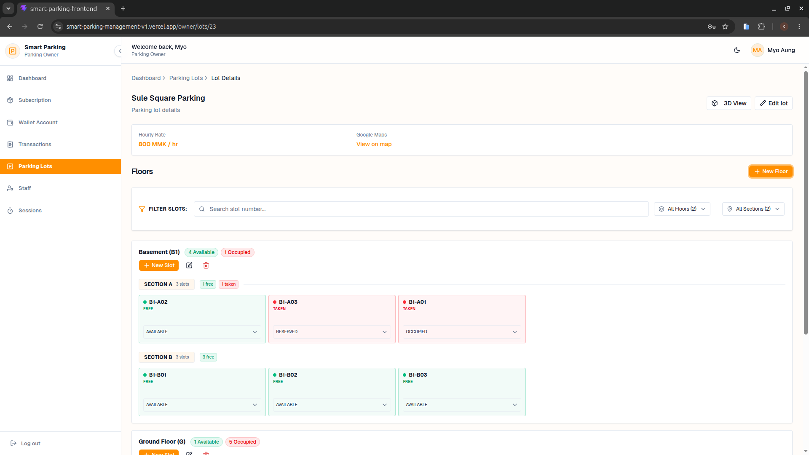

**What it shows:**

A tabbed interface per lot:

**Floors tab:**

- Lists all floors. Actions: add, edit, or delete a floor (deletion cascades to slots).

**Slots tab (per floor):**

- Grid of slots with slot number, section, and status.
- Actions: add a new slot (slot number + section + optional GPS), edit, or delete a slot (blocked if session is active).

---

### 3.3.3.5 Staff Management

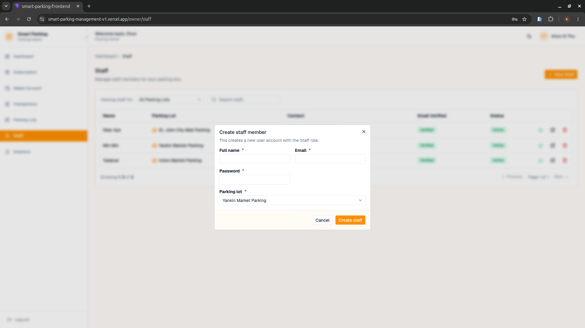

**What it shows:**

Staff assigned to each lot. Actions:

- **Invite** staff by entering their email (user must already exist with `STAFF` role; `max_staff` limit enforced).
- **Remove** staff (unlinks from lot; user account remains).

---

### 3.3.3.6 Sessions & Revenue

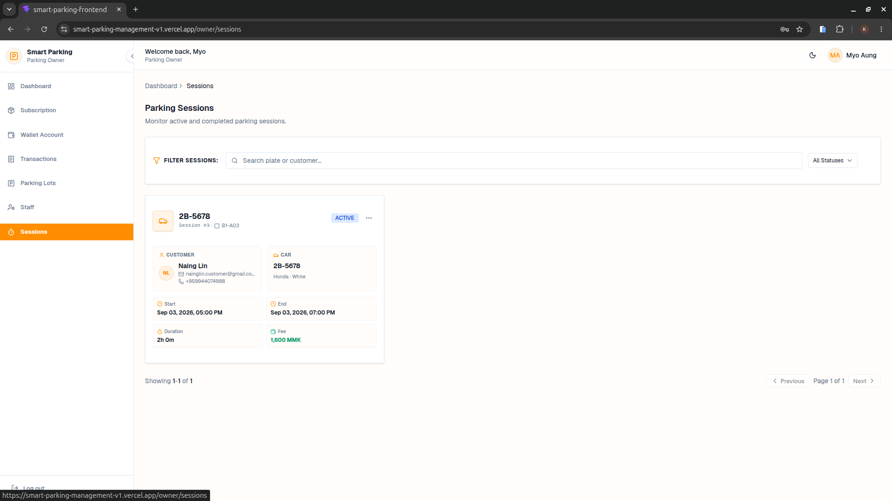

**What it shows:**

All sessions across owned lots: Customer, Car Plate, Lot, Slot, Start/End, Duration, Fee, Status.

The **Revenue Summary** tab shows:

- Total revenue by lot
- Revenue trend chart (daily/monthly)
- Average session duration

---

### 3.3.3.7 Owner Wallet Account

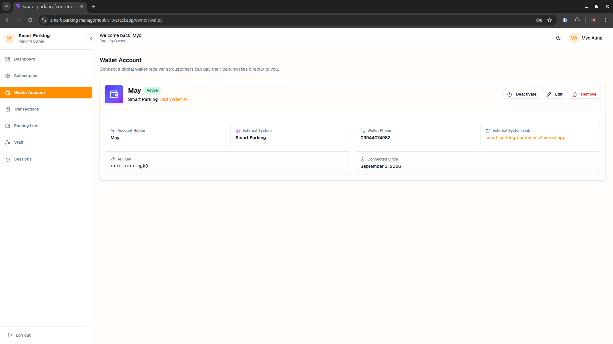

**What it shows:**

Configuration for the owner's wallet (receives customer session payments):

- Wallet Name, Wallet Phone Number, API Key

Separate from the Admin's platform wallet (which receives owner subscription payments).

---

## 3.3.4 Management Portal — Staff Role

After logging in as Staff, the sidebar shows only: Dashboard, Slot Board, Sessions.

**Staff seed credentials (password:** `asdffdsa`**):**


| Email                      | Assigned Lot            |
| -------------------------- | ----------------------- |
| `khunsithu2003@gmail.com`  | Yangon Central Parking  |
| `zawlin.staff@gmail.com`   | Sule Square Parking     |
| `susuhtwe.staff@gmail.com` | Junction Square Parking |
| `kyawkyaw.staff@gmail.com` | Junction City Parking   |

---

### 3.3.4.1 Staff Dashboard

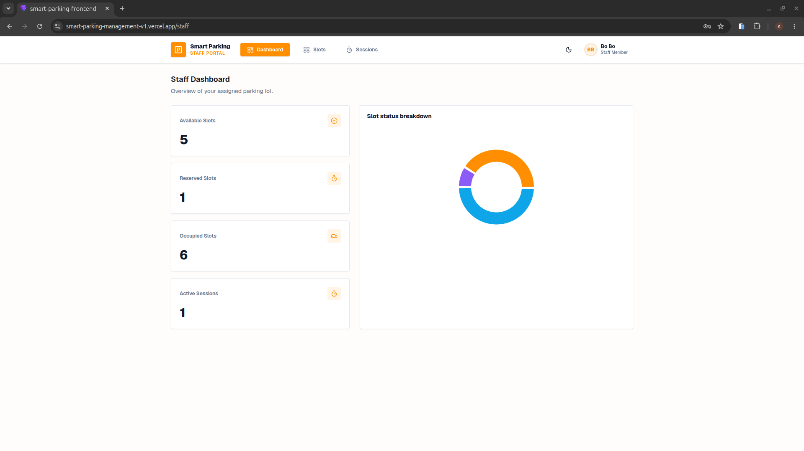

**What it shows:**

Focused operational summary for the assigned lot:

- Active Sessions count, Available Slots count
- Quick link to Slot Board

---

### 3.3.4.2 Slot Board

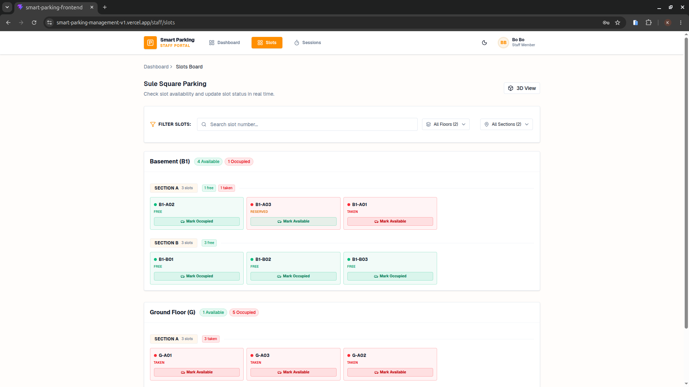

**What it shows:**

- **Floor Tabs** — One tab per floor of the assigned lot.
- **Slot Grid** — Color-coded:
  - 🟢 Green = `AVAILABLE`
  - 🔴 Red = `OCCUPIED` (shows car plate on hover)
- **Search by Plate Number** — Highlights the matching slot and shows session details.

---

### 3.3.4.3 Finish an Active Session

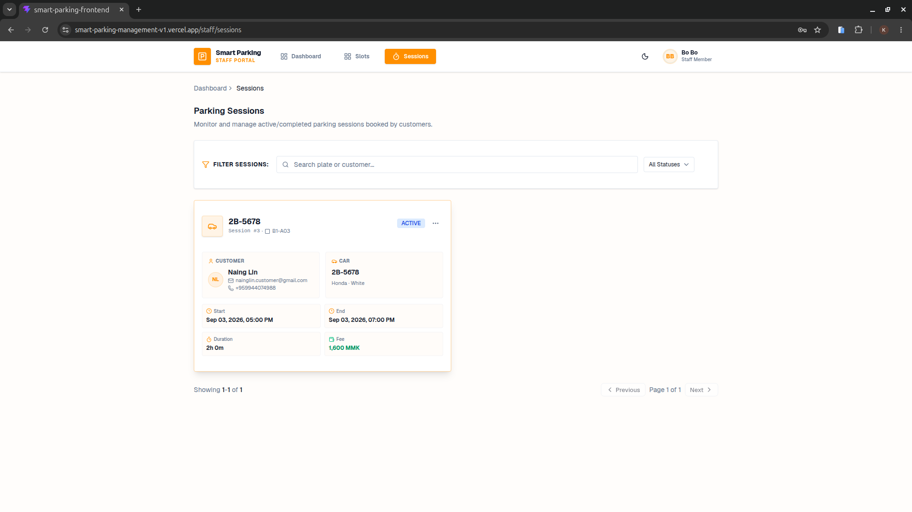

**How it works:**

1. Hover over an occupied slot on the Slot Board → session popover appears.
2. Click **"View Session"** → session detail page opens.
3. Click **"Finish Session"** → system calculates final fee (`ceil(actual_hours) × rate_per_hour`).
4. Slot changes back to 🟢 `AVAILABLE`.
5. Receipt with final fee is displayed.

---

### 3.3.4.4 Sessions List (Staff View)

📸 *\[Insert screenshot: Staff — Sessions List\]*

**What it shows:**

All sessions for the assigned lot, filterable by status:

- **PENDING** — Booked, payment not yet confirmed
- **ACTIVE** — Payment confirmed, vehicle currently parked
- **FINISHED** — Session completed, slot released

Clicking any session opens full session details; active sessions show the Finish action.

---

## 3.4 Deployment

The system is containerised for consistent environment parity between development and production.

```yaml
# docker-compose.yml (simplified)
services:
  smart-parking-api:
    build: ./smart-parking-api
    ports: ["8000:8000"]
    env_file: ./smart-parking-api/.env

  smart-parking-management:
    build: ./smart-parking-management
    ports: ["3001:80"]

  smart-parking-customer:
    build: ./smart-parking-customer
    ports: ["3000:80"]
```

For cloud deployment, `render.yaml` defines three Render services: one Web Service for the API and two Static Sites for the frontends. The API's `DATABASE_URL` points to a managed PostgreSQL database on Render.

---

# Chapter 4 — Conclusion and References

## 4.1 Conclusion

The Smart Parking Lot Management System successfully demonstrates how a modern, multi-tenant web platform can address the real-world inefficiencies of traditional parking lot management. By combining a well-structured RESTful API backend, two role-differentiated frontend applications, and an external digital wallet payment integration, the system delivers end-to-end value across all stakeholder groups.

### Key Achievements

- **Clean role-based architecture** — Four distinct user roles (`ADMIN`, `OWNER`, `STAFF`, `CUSTOMER`) with strictly enforced permission boundaries at both the API and UI routing layers prevent unauthorised access to sensitive functionality.
- **Robust session lifecycle engine** — The booking system enforces conflict-free scheduling with car-level and slot-level checks, a 2-hour buffer gap policy, and an automated fee calculation, eliminating manual billing errors.
- **Two-phase digital payment integration** — The OTP-based wallet payment flow provides a secure, auditable payment trail for both session fees and subscription purchases, replacing error-prone cash handling.
- **Subscription-gated growth model** — The package/subscription system gives the platform administrator commercial control over how operators grow (max lots, max staff, duration), enabling a viable SaaS business model.
- **Production-ready deployment** — Docker containerisation and `render.yaml` cloud configuration ensure the system can be deployed reliably and consistently across environments.
- **Developer experience** — Auto-generated OpenAPI documentation (Swagger UI / ReDoc), a Postman collection, Alembic migrations, and a seed script make the system straightforward for developers to set up and iterate on.

### Limitations and Future Work


| Limitation                                    | Proposed Future Enhancement                                                                       |
| --------------------------------------------- | ------------------------------------------------------------------------------------------------- |
| No hardware integration                       | Integrate ANPR cameras and barrier gates via MQTT/WebSocket                                       |
| No native mobile apps                         | Build React Native apps using the existing REST API                                               |
| Slot scheduling uses time-window booking only | Add support for walk-in (open-ended) sessions with real-time sensor data                          |
| No self-service password reset flow           | Implement email-based password reset using a secure token link                                    |
| No real-time slot status push                 | Integrate WebSocket notifications so the slot board auto-refreshes                                |
| No real-time WebSocket push for slot events   | Integrate WebSocket or SSE so the customer app and slot board auto-refresh without manual polling |

---

## 4.2 References

1. **FastAPI Documentation** — Sebastián Ramírez. *FastAPI — Modern, fast (high-performance) web framework for building APIs with Python.* https://fastapi.tiangolo.com
2. **SQLAlchemy 2.0 Documentation** — Mike Bayer et al. *SQLAlchemy — The Python SQL Toolkit and Object Relational Mapper.* https://docs.sqlalchemy.org/en/20/
3. **Pydantic v2 Documentation** — Samuel Colvin et al. *Pydantic — Data validation using Python type annotations.* https://docs.pydantic.dev/latest/
4. **Alembic Documentation** — Mike Bayer. *Alembic — A lightweight database migration tool for SQLAlchemy.* https://alembic.sqlalchemy.org/en/latest/
5. **React Documentation** — Meta Open Source. *React — A JavaScript library for building user interfaces.* https://react.dev
6. **TanStack Query v5** — Tanner Linsley. *TanStack Query — Powerful asynchronous state management for TypeScript/JavaScript.* https://tanstack.com/query/latest
7. **React Router v7 Documentation** — Remix Team. *React Router — Declarative Routing for React.* https://reactrouter.com
8. **Zustand** — Paul Henschel et al. *Zustand — A small, fast, and scalable bearbones state management solution.* https://github.com/pmndrs/zustand
9. **shadcn/ui** — shadcn. *shadcn/ui — Beautifully designed components built with Radix UI and Tailwind CSS.* https://ui.shadcn.com
10. **Tailwind CSS v4** — Adam Wathan et al. *Tailwind CSS — A utility-first CSS framework.* https://tailwindcss.com
11. **Vite** — Evan You. *Vite — Next generation front-end tooling.* https://vitejs.dev
12. **Docker Documentation** — Docker Inc. *Docker — Empowering App Development for Developers.* https://docs.docker.com
13. **JSON Web Tokens (JWT) Specification** — M. Jones, J. Bradley, N. Sakimura. *RFC 7519 — JSON Web Token (JWT).* https://datatracker.ietf.org/doc/html/rfc7519
14. **Recharts** — Recharts Group. *Recharts — A composable charting library built on React components.* https://recharts.org
15. **Axios** — Matt Zabriskie et al. *Axios — Promise based HTTP client for the browser and node.js.* https://axios-http.com
16. **React Hook Form** — Beier Liu. *React Hook Form — Performant, flexible and extensible forms with easy-to-use validation.* https://react-hook-form.com
17. **Zod** — Colin McDonnell. *Zod — TypeScript-first schema validation with static type inference.* https://zod.dev

---

*End of Document*
