# Smart Parking Lot Management System
### Project Documentation

---

> [!NOTE]
> This document covers the full lifecycle of the Smart Parking Lot Management System — from its motivation and scope through its technical design, implementation details, and conclusions.

---

## Table of Contents

- [Chapter 1 — Introduction](#chapter-1--introduction)
  - [1.1 Introduction](#11-introduction)
  - [1.2 Scope](#12-scope)
  - [1.3 Problem Statement](#13-problem-statement)
  - [1.4 Motivation of the Project](#14-motivation-of-the-project)
  - [1.5 Project Objectives](#15-project-objectives)
  - [1.6 Background Technology](#16-background-technology)
- [Chapter 2 — System Design](#chapter-2--system-design)
  - [2.1 Schema Diagram](#21-schema-diagram)
  - [2.2 Class Diagram](#22-class-diagram)
  - [2.3 Use Case Diagram](#23-use-case-diagram)
  - [2.4 Sequence Diagram](#24-sequence-diagram)
- [Chapter 3 — Project Implementation](#chapter-3--project-implementation)
- [Chapter 4 — Conclusion and References](#chapter-4--conclusion-and-references)

---

# Chapter 1 — Introduction

## 1.1 Introduction

The **Smart Parking Lot Management System** is a full-stack, cloud-ready web platform designed to digitise and streamline the management of parking facilities. Traditional parking lots rely on manual entry-and-exit recording, paper-based ticketing, and cash-only payment methods — all of which are error-prone, inefficient, and difficult to scale. This system replaces those workflows with a centralised, role-based digital platform that connects every stakeholder — from system administrators and parking lot owners to operational staff and end-user customers — through a single, coherent set of web interfaces and a RESTful API backend.

The platform is composed of three independently deployable sub-systems:

| Sub-System | Technology | Purpose |
|---|---|---|
| `smart-parking-api` | Python 3.12 / FastAPI | RESTful backend API, business logic, database |
| `smart-parking-management` | React 19 / TypeScript / Vite | Admin, Owner, and Staff web portal |
| `smart-parking-customer` | React 19 / TypeScript / Vite | Customer-facing web application |

All three components are containerised with Docker and can be orchestrated via `docker-compose` for both local development and cloud deployment (Render).

---

## 1.2 Scope

The system covers the following functional areas:

### In Scope

- **User Management & Authentication** — Registration, email OTP verification, JWT-based login with refresh tokens, role-based access control (RBAC) for four distinct user roles: `ADMIN`, `OWNER`, `STAFF`, and `CUSTOMER`.
- **Parking Infrastructure Management** — Hierarchical management of parking lots → floors → slots, including geo-location data (latitude/longitude) and Google Maps URL for each lot.
- **Booking & Session Lifecycle** — Customers book parking slots for specific time windows; sessions transition through `PENDING → ACTIVE → FINISHED` states with automatic fee calculation based on hourly rates.
- **Digital Wallet Payment Integration** — Integration with an external digital wallet backend for session fee and subscription payments, supporting an OTP-based payment confirmation flow.
- **Subscription Packages** — Admins define tiered subscription packages (with maximum lots and staff quotas); parking owners purchase subscriptions to unlock lot-creation capabilities.
- **Analytics Dashboard** — Role-specific dashboards surface revenue summaries, occupancy statistics, session counts, and subscription status.
- **3D Parking Lot Visualisation** — The customer app renders an interactive, three-dimensional view of parking floors and slot availability.

### Out of Scope

- Hardware integration (barrier gates, ANPR cameras, IoT sensors)
- Native mobile applications (iOS / Android)
- Multi-currency support
- Self-service password reset via email (noted as a known limitation)

---

## 1.3 Problem Statement

Urban areas worldwide face an increasing burden from vehicle congestion, with a significant proportion of city traffic attributable to drivers searching for available parking. The key pain points with conventional parking lot management include:

1. **No Real-Time Availability Information** — Drivers have no way to know in advance whether a parking lot has free slots, leading to wasted fuel and time circling the facility.
2. **Manual and Error-Prone Entry/Exit Recording** — Staff manually record vehicle arrivals and departures on paper or in spreadsheets, introducing inaccuracies in billing and session tracking.
3. **Cash-Only Payment Limitations** — Traditional parking facilities accept cash only, which is inconvenient for customers and difficult to audit for owners.
4. **Fragmented Management** — Parking lot owners managing multiple locations lack a unified system to monitor occupancy, track revenue, and manage staff across all sites.
5. **No Subscription or Business Model Support** — There is no mechanism for operators to offer different tiers of service or to manage their own growth within a controlled platform.
6. **Lack of Audit Trail** — Without a digital system, it is impossible to produce accurate historical reports for occupancy rates, revenue trends, or individual session disputes.

This project addresses all six problems by providing a unified, digital, role-aware platform.

---

## 1.4 Motivation of the Project

The motivation for developing this system stems from several converging factors:

- **Growing Urban Mobility Demand** — As vehicle ownership rises in cities, parking management becomes a critical piece of urban infrastructure. A software-first approach can dramatically improve throughput and customer experience.
- **Digital Payment Adoption** — The rapid adoption of digital wallet services creates an opportunity to replace cash-based parking payments with a seamless, traceable, OTP-confirmed payment flow.
- **Demand for Multi-Tenant SaaS Platforms** — There is a clear market gap for a platform that allows multiple independent parking operators to manage their own facilities under a single umbrella, governed by a system administrator.
- **Academic and Technical Growth** — Building a system of this complexity — spanning backend API design, relational database modelling, frontend state management, external payment integration, and containerised deployment — provides a holistic software engineering challenge that demonstrates modern full-stack development skills.
- **Scalability Requirement** — A RESTful API backend with a clean repository-service-schema layered architecture can be scaled horizontally, making the system viable not just for a single lot but for city-wide deployment.

---

## 1.5 Project Objectives

The project is designed to achieve the following concrete objectives:

1. **Deliver a role-based management portal** for Admins, Owners, and Staff with dedicated dashboards, data tables, and CRUD capabilities for every resource they govern.
2. **Deliver a customer-facing web app** that allows customers to register (with email OTP verification), search for available parking lots, view slot availability in a 3D interactive layout, book a session for a specific time window, and pay via digital wallet.
3. **Implement a robust JWT authentication system** with short-lived access tokens, refresh token rotation, and a token blacklist for secure logout.
4. **Implement a session lifecycle engine** that enforces business rules: only one active/pending session per car and per slot at a time, a 2-hour buffer gap between consecutive slot bookings, and automatic fee calculation based on per-lot hourly rates.
5. **Integrate an external digital wallet payment gateway** supporting two-phase payments (initiate → confirm with OTP/PIN) for both parking session fees and owner subscription payments.
6. **Build a subscription management system** where the Admin defines tiered `Package` offerings (max lots, max staff, duration, price) and Owners purchase them to unlock platform capabilities.
7. **Provide an analytics dashboard** with revenue totals, occupancy summaries, and session/subscription statistics, visualised with charts.
8. **Package and deploy** the entire stack using Docker and `docker-compose`, with configuration for cloud deployment on Render.

---

## 1.6 Background Technology

### Backend: Python / FastAPI

**FastAPI** (v0.100+) is a modern, high-performance Python web framework built on top of Starlette and Pydantic. It generates OpenAPI documentation automatically, supports native async operations, and uses Python type hints for request/response validation. **Uvicorn** serves as the ASGI server.

**SQLAlchemy 2.0** is used as the ORM, with its new `mapped_column` / `Mapped` declarative style providing a clean, type-safe model definition. **Alembic** handles database schema migrations, allowing schema changes to be version-controlled alongside application code. The default datastore is **SQLite** (for portability), but the `DATABASE_URL` environment variable supports PostgreSQL or MySQL for production.

**Pydantic v2** validates all incoming request bodies and outgoing response payloads through schema classes, ensuring data integrity at API boundaries. **PyJWT** handles JSON Web Token creation and verification for authentication. **Passlib + bcrypt** are used for secure password hashing.

### Frontend: React / TypeScript / Vite

Both frontend applications are built with **React 19** and **TypeScript**, scaffolded with **Vite** for fast Hot Module Replacement and optimised production builds. **Tailwind CSS v4** (via `@tailwindcss/vite`) provides utility-first styling, and **shadcn/ui** supplies accessible, composable UI primitives built on Radix UI.

**React Router v7** handles client-side routing with protected/public route guards. **TanStack Query v5** (formerly React Query) manages all server state: data fetching, caching, background refetching, and mutations. **Zustand** with `localStorage` persistence manages authentication state (access token, refresh token, and current user). **React Hook Form + Zod** handle form state management and schema validation. **Recharts** renders interactive charts for dashboard analytics. **Axios** with request interceptors attaches JWT bearer tokens and performs silent token refresh on 401 responses.

### Infrastructure

The platform is containerised with **Docker** (multi-stage builds) and orchestrated with **Docker Compose**. A shared `docker-compose.yml` at the repository root starts all three services simultaneously. Production deployment targets **Render**, configured via `render.yaml`. Each frontend container is served by **Nginx**.

---

# Chapter 2 — System Design

## 2.1 Schema Diagram

The database schema consists of **17 tables** organised into logical groups: Authentication, User Profiles, Parking Infrastructure, Session & Payment, and Subscription.

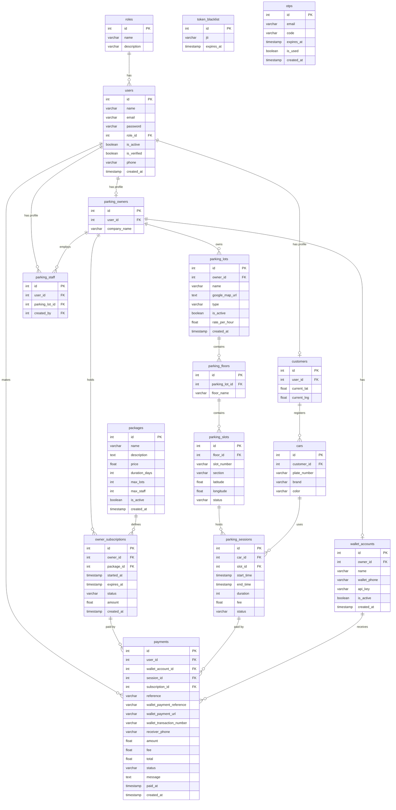

---

## 2.2 Class Diagram

The following class diagram shows the primary domain models and their key attributes and relationships in the backend application layer.

```mermaid
classDiagram
    class Role {
        +int id
        +str name
        +str description
        +list~User~ users
        +get_users() list~User~
        +is_admin() bool
        +is_owner() bool
        +is_staff() bool
        +is_customer() bool
    }

    class User {
        +int id
        +str name
        +str email
        +str password
        +int role_id
        +bool is_active
        +bool is_verified
        +str phone
        +datetime created_at
        +Role role
        +ParkingOwner owner_profile
        +ParkingStaff staff_profile
        +Customer customer_profile
        +list~Payment~ payments
        +verify_password(plain_password) bool
        +hash_password(plain_password) str
        +verify_email() void
        +activate() void
        +deactivate() void
        +get_role_name() str
    }

    class ParkingOwner {
        +int id
        +int user_id
        +str company_name
        +User user
        +list~ParkingLot~ parking_lots
        +list~ParkingStaff~ staff
        +list~OwnerSubscription~ subscriptions
        +WalletAccount wallet_account
        +get_active_subscription() OwnerSubscription
        +can_create_lot() bool
        +can_add_staff() bool
        +get_total_revenue() float
    }

    class Customer {
        +int id
        +int user_id
        +float current_lat
        +float current_lng
        +User user
        +list~Car~ cars
        +get_active_session() ParkingSession
        +get_cars() list~Car~
        +update_location(lat, lng) void
    }

    class ParkingStaff {
        +int id
        +int user_id
        +int parking_lot_id
        +int created_by
        +User user
        +ParkingLot parking_lot
        +get_assigned_lot() ParkingLot
        +can_manage_session(session_id) bool
    }

    class Car {
        +int id
        +int customer_id
        +str plate_number
        +str brand
        +str color
        +Customer customer
        +list~ParkingSession~ sessions
        +is_currently_parked() bool
        +get_session_history() list~ParkingSession~
    }

    class ParkingLot {
        +int id
        +int owner_id
        +str name
        +str google_map_url
        +str type
        +bool is_active
        +float rate_per_hour
        +datetime created_at
        +ParkingOwner owner
        +list~ParkingFloor~ floors
        +list~ParkingStaff~ staff
        +get_total_slots() int
        +get_available_slots() int
        +get_occupancy_rate() float
        +is_open() bool
    }

    class ParkingFloor {
        +int id
        +int parking_lot_id
        +str floor_name
        +ParkingLot parking_lot
        +list~ParkingSlot~ slots
        +get_available_slot_count() int
        +add_slot(slot_number, section) ParkingSlot
    }

    class ParkingSlot {
        +int id
        +int floor_id
        +str slot_number
        +str section
        +float latitude
        +float longitude
        +str status
        +ParkingFloor floor
        +list~ParkingSession~ sessions
        +is_available() bool
        +mark_occupied() void
        +mark_available() void
        +check_schedule_conflict(start, end) bool
    }

    class ParkingSession {
        +int id
        +int car_id
        +int slot_id
        +datetime start_time
        +datetime end_time
        +int duration
        +float fee
        +str status
        +Car car
        +ParkingSlot slot
        +list~Payment~ payments
        +calculate_fee(rate_per_hour) float
        +start_session() void
        +finish_session() void
        +is_active() bool
        +is_conflict(start, end) bool
    }

    class Package {
        +int id
        +str name
        +str description
        +float price
        +int duration_days
        +int max_lots
        +int max_staff
        +bool is_active
        +datetime created_at
        +list~OwnerSubscription~ subscriptions
        +is_valid() bool
        +get_formatted_price() str
    }

    class OwnerSubscription {
        +int id
        +int owner_id
        +int package_id
        +datetime started_at
        +datetime expires_at
        +str status
        +float amount
        +datetime created_at
        +ParkingOwner owner
        +Package package
        +list~Payment~ payments
        +is_active() bool
        +is_expired() bool
        +extend_duration(days) void
    }

    class WalletAccount {
        +int id
        +int owner_id
        +str name
        +str wallet_phone
        +str api_key
        +bool is_active
        +datetime created_at
        +ParkingOwner owner
        +list~Payment~ payments
        +verify_api_key(key) bool
        +generate_api_key() str
    }

    class Payment {
        +int id
        +int user_id
        +int wallet_account_id
        +int session_id
        +int subscription_id
        +str reference
        +str wallet_payment_reference
        +str wallet_payment_url
        +str wallet_transaction_number
        +str receiver_phone
        +float amount
        +float fee
        +float total
        +str status
        +str message
        +datetime paid_at
        +datetime created_at
        +initiate_payment() str
        +confirm_payment(otp, pin) bool
        +mark_completed() void
        +mark_failed(reason) void
    }

    Role "1" --> "0..*" User
    User "1" --> "0..1" ParkingOwner
    User "1" --> "0..1" Customer
    User "1" --> "0..1" ParkingStaff
    User "1" --> "0..*" Payment
    ParkingOwner "1" --> "0..*" ParkingLot
    ParkingOwner "1" --> "0..*" ParkingStaff
    ParkingOwner "1" --> "0..*" OwnerSubscription
    ParkingOwner "1" --> "0..1" WalletAccount
    Customer "1" --> "0..*" Car
    ParkingLot "1" --> "0..*" ParkingFloor
    ParkingLot "1" --> "0..*" ParkingStaff
    ParkingFloor "1" --> "0..*" ParkingSlot
    ParkingSlot "1" --> "0..*" ParkingSession
    Car "1" --> "0..*" ParkingSession
    Package "1" --> "0..*" OwnerSubscription
    OwnerSubscription "1" --> "0..*" Payment
    ParkingSession "1" --> "0..*" Payment
    WalletAccount "1" --> "0..*" Payment
```

---

## 2.3 Use Case Diagram

The system defines four actors — **System Admin**, **Parking Owner**, **Parking Staff**, and **Customer** — each with a distinct set of permitted actions. The subsections below present standard UML Use Case Diagrams for each role, with an outer **System Boundary** box enclosing oval use cases and explicit `<<include>>` / `<<extend>>` relationships:

- **Solid line** `---` — Actor association to entry-point use cases.
- **Dashed arrow** `-.->` labelled `<<include>>` — mandatory dependency (base use case **always** triggers included use case).
- **Dashed arrow** `-.->` labelled `<<extend>>` — optional functionality (extending use case conditionally extends base use case).

---

### 2.3.1 System Admin Use Cases

The System Admin is the platform super-user. Admin accounts are seeded by the system and govern user management, monitoring parking owners, package management, and system-wide settings. Admin users do not register or create parking owner accounts; parking owners self-register.

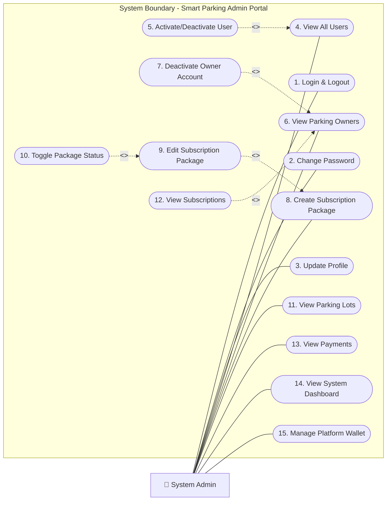

| Use Case | Relationship | Description |
|---|---|---|
| **Login and Logout** | — | Authenticate using email and password; receive JWT access and refresh tokens. Logout blacklists the refresh token. |
| **Change Password** | — | Update the account password by providing the current password and a new password. |
| **Update Profile** | — | Edit account name and phone number. |
| **View All Users** | — | Browse and search all registered users across every role on the platform. |
| **Activate or Deactivate User** | `<<extend>>` View All Users | Optional action performed while viewing users — toggled without leaving the list view. |
| **View All Parking Owners** | — | List all registered parking owner accounts with their company names and subscription status. |
| **Deactivate Owner Account** | `<<extend>>` View All Parking Owners | Optional suspension action available when viewing an owner's detail record. |
| **Create Subscription Package** | — | Define a new tiered subscription plan with price, duration, and lot/staff limits. |
| **Edit Subscription Package** | `<<extend>>` Create Subscription Package | Optional modification of an existing package after it has been created. |
| **Activate or Deactivate Package** | `<<extend>>` Edit Subscription Package | Optional availability toggle, always triggered through the edit flow. |
| **View All Parking Lots** | — | Read-only platform-wide overview of all registered lots. |
| **View All Subscriptions** | `<<include>>` View All Parking Owners | Always displays owner context alongside each subscription record. |
| **View All Payments** | — | Audit the complete payment ledger for session fees and subscription purchases. |
| **View System Dashboard** | — | Aggregated platform statistics: total revenue, active sessions, users, and owner counts. |
| **Create Platform Wallet Account** | — | Register the Admin's digital wallet API key that receives subscription fees. |
| **Update Platform Wallet Account** | `<<extend>>` Create Platform Wallet Account | Optional rotation of API key or wallet phone after the account has been created. |

---

### 2.3.2 Parking Owner Use Cases

A Parking Owner manages one or more parking facilities on the platform. Parking Owners self-register their accounts. The number of lots and staff they can create is governed by their active subscription package.

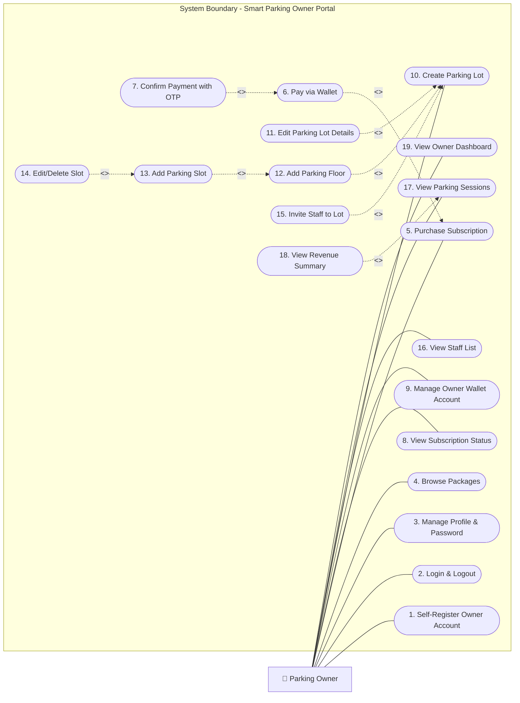

| Use Case | Relationship | Description |
|---|---|---|
| **Self-Register Owner Account** | — | Register a new owner account directly via `/auth/register-owner` with company details. |
| **Login and Logout** | — | Authenticate with JWT tokens. |
| **Change Password** | — | Update account password from the profile settings page. |
| **Update Profile** | — | Edit display name and phone number. |
| **Browse Available Packages** | — | View all active subscription packages with price, duration, and lot/staff limits. |
| **Purchase Subscription** | — | Initiate a subscription to a chosen package, creating a PENDING subscription record. |
| **Pay Subscription via Wallet** | `<<include>>` Purchase Subscription | Always triggered after initiating a subscription — starts the two-phase wallet payment. |
| **Confirm Subscription Payment with OTP** | `<<include>>` Pay Subscription via Wallet | Always required to finalise payment — submits OTP and PIN to activate the subscription. |
| **View Subscription Status** | — | Check current expiry date, package tier, and payment history. |
| **Create Owner Wallet Account** | — | Register the digital wallet API key that receives parking session fees from customers. |
| **Update Owner Wallet Account** | `<<extend>>` Create Owner Wallet Account | Optionally rotate API key or update wallet phone after initial creation. |
| **Create Parking Lot** | — | Add a new lot with name, type, hourly rate, and map URL. Requires an active subscription within lot limits. |
| **Edit Parking Lot Details** | `<<extend>>` Create Parking Lot | Optionally update lot name, rate, map URL, or type after creation. |
| **Activate or Deactivate Lot** | `<<extend>>` Edit Parking Lot Details | Optionally toggle lot visibility from within the edit flow. |
| **Add Parking Floor** | `<<include>>` Create Parking Lot | Always requires an existing lot — floor cannot exist independently. |
| **Edit or Delete Floor** | `<<extend>>` Add Parking Floor | Optionally rename or remove a floor after it has been created. |
| **Add Parking Slot** | `<<include>>` Add Parking Floor | Always requires an existing floor — slot cannot exist without a floor. |
| **Edit or Delete Slot** | `<<extend>>` Add Parking Slot | Optionally update slot details or remove a slot after creation. |
| **Invite Staff to Lot** | `<<include>>` Create Parking Lot | Always requires an existing lot to assign staff to. Respects max_staff subscription limit. |
| **Remove Staff from Lot** | `<<extend>>` View Staff List | Optionally unlinks a staff member when viewing the staff list. |
| **View Staff List** | — | See all staff members assigned to each of the owner's lots. |
| **View Parking Sessions** | — | List all sessions (PENDING, ACTIVE, FINISHED) across the owner's lots. |
| **View Revenue Summary** | `<<extend>>` View Parking Sessions | Optional aggregated revenue view triggered from within the sessions page. |
| **View Owner Dashboard** | — | Summary cards: active sessions, today's revenue, slot occupancy rate, subscription status. |

---

### 2.3.3 Parking Staff Use Cases

Parking Staff are operational users assigned to a specific parking lot by its owner. Their role focuses on day-to-day vehicle management: monitoring slot occupancy and closing out parking sessions when customers exit.

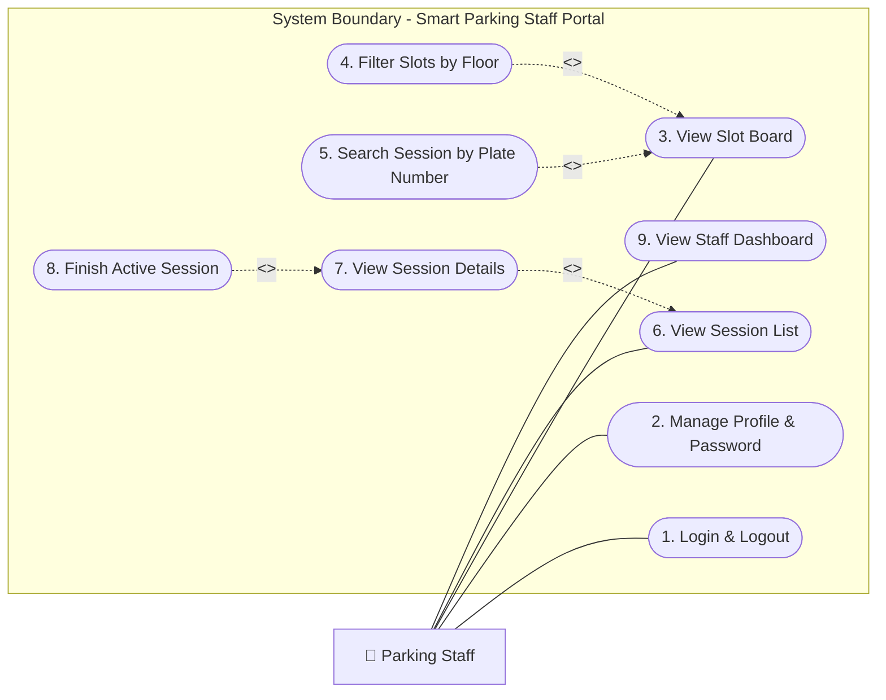

| Use Case | Relationship | Description |
|---|---|---|
| **Login and Logout** | — | Authenticate using credentials created by the Parking Owner. |
| **Change Password** | — | Update account password via the profile settings page. |
| **Update Profile** | — | Edit display name and phone number. |
| **View Slot Board for Assigned Lot** | — | Real-time occupancy grid of all slots across floors for the assigned lot. |
| **View Slot Availability by Floor** | `<<include>>` View Slot Board | Always triggered as part of viewing the slot board — the board is organised by floor tabs. |
| **Search Session by Plate Number** | `<<extend>>` View Slot Board | Optional search action available from the slot board to locate a session by plate. |
| **View Session List** | — | Browse all sessions visible to this staff member's assigned lot, with status filters. |
| **View Session Details** | `<<include>>` View Session List | Always navigated to from the session list — requires a session record to be selected first. |
| **Finish Active Parking Session** | `<<include>>` View Session Details · `<<extend>>` View Session Details | Always requires viewing session details first; the finish action is then optionally triggered from that detail view. |
| **View Staff Dashboard** | — | Summary of active sessions in progress at the assigned lot and any pending actions. |

---

### 2.3.4 Customer Use Cases

Customers are end-users of the parking platform. They self-register, manage vehicles, discover parking lots, book time-window slots, and pay via the integrated digital wallet. The customer-facing application is a separate standalone web app.

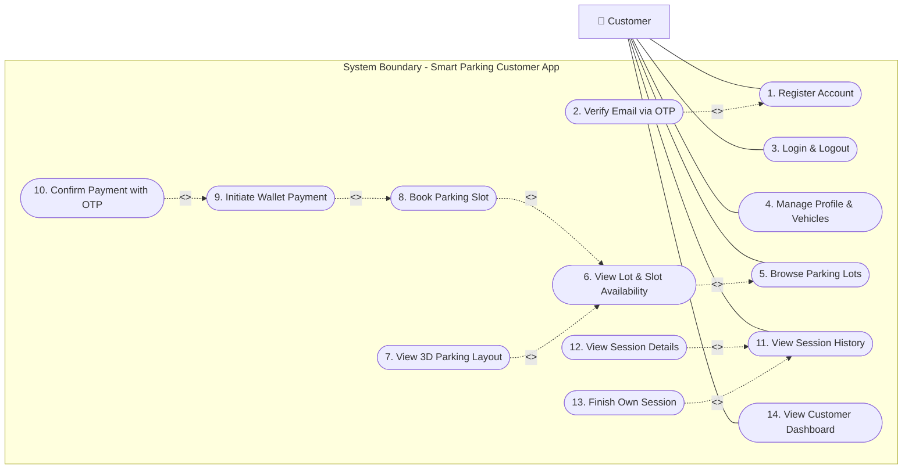

| Use Case | Relationship | Description |
|---|---|---|
| **Register New Account** | — | Self-register with name, email, and password. Account starts in an unverified state. |
| **Verify Email via OTP** | `<<include>>` Register New Account | Always required immediately after registration — submits the OTP sent to the registered email. |
| **Login and Logout** | — | Authenticate with email and password. Logout revokes the refresh token. |
| **Change Password** | — | Update account password from the profile page. |
| **Update Profile** | — | Edit display name and phone number. |
| **Add Vehicle** | — | Register a car with plate number, brand, and colour. Plate must be unique across the platform. |
| **Edit Vehicle Details** | `<<extend>>` View Vehicle List | Optionally triggered when viewing the vehicle list to update brand or colour. |
| **Delete Vehicle** | `<<extend>>` View Vehicle List | Optionally remove a vehicle from the list. Vehicles with active sessions cannot be deleted. |
| **View Vehicle List** | — | See all registered cars linked to the customer account. |
| **Browse Available Parking Lots** | — | View active PUBLIC parking lots with names, locations, and hourly rates. |
| **View Lot Details and Location** | `<<include>>` Browse Available Parking Lots | Always navigated to from the lot list — requires a lot to be selected first. |
| **View Floor and Slot Availability** | `<<include>>` View Lot Details and Location | Always loaded as part of the lot detail page — shows per-floor slot grid. |
| **View 3D Parking Layout** | `<<extend>>` View Floor and Slot Availability | Optionally switch to an interactive 3D floor view from the slot grid. |
| **View 3D Slot View** | `<<extend>>` View 3D Parking Layout | Optionally drill into an immersive 3D view of a single slot from the 3D floor view. |
| **Book Parking Slot for Time Window** | `<<include>>` View Floor and Slot Availability | Always triggered from the slot grid — requires a visible AVAILABLE slot to book. |
| **Initiate Wallet Payment for Session** | `<<include>>` Book Parking Slot | Always triggered immediately after a booking is created — starts the two-phase wallet payment. |
| **Confirm Payment with OTP and PIN** | `<<include>>` Initiate Wallet Payment | Always required to finalise payment — submits OTP and PIN; on success the session becomes ACTIVE. |
| **Finish Own Parking Session** | `<<extend>>` View Own Sessions | Optionally mark an ACTIVE session as FINISHED from the sessions list, releasing the slot. |
| **View Own Sessions** | — | Browse all personal sessions with status filters and fee summaries. |
| **View Session Details and Fee** | `<<include>>` View Own Sessions | Always navigated to from the session list to view the full session record and payment reference. |
| **View Customer Dashboard** | — | Summary showing the current active session, recent history, and quick links to browse lots and manage vehicles. |


## 2.4 Sequence Diagram

Each role's core workflows are illustrated below using sequence diagrams. Actors interact left-to-right through the **Management App** or **Customer App** → **Smart Parking API** → **Database**, with external services (Email, Digital Wallet) where applicable.

---

## 2.4.1 System Admin Sequence Diagrams

### 2.4.1.1 Admin Login

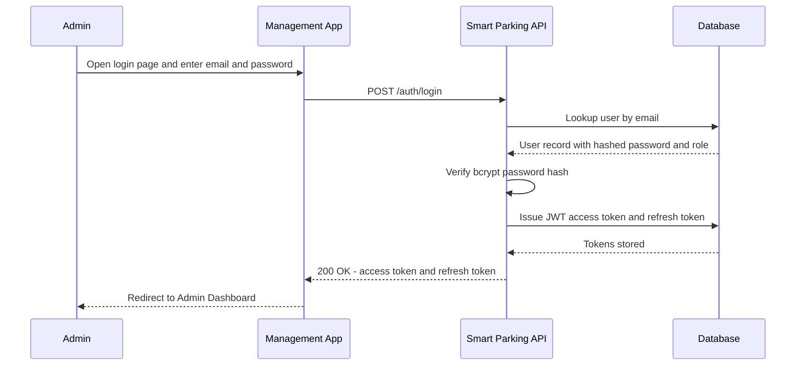

---

### 2.4.1.2 Create and Manage a Subscription Package

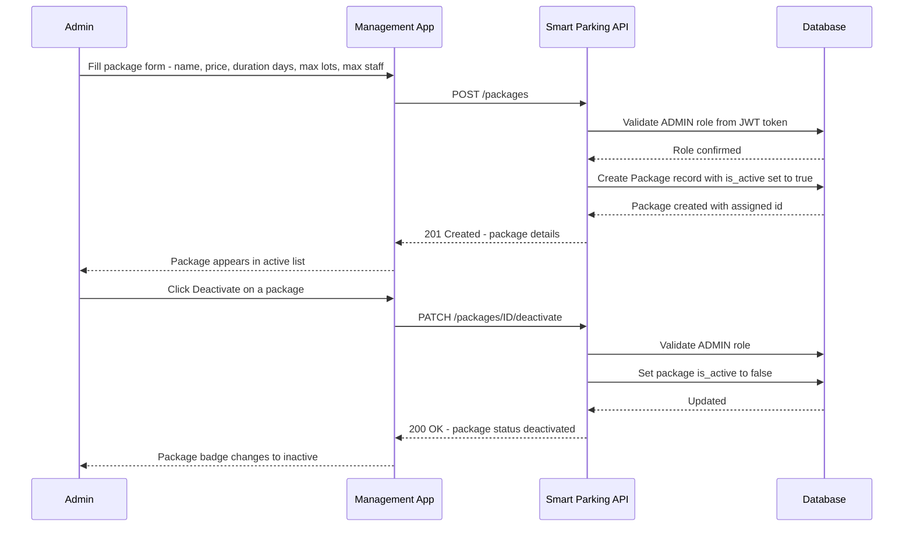

---

### 2.4.1.3 Deactivate a Parking Owner Account

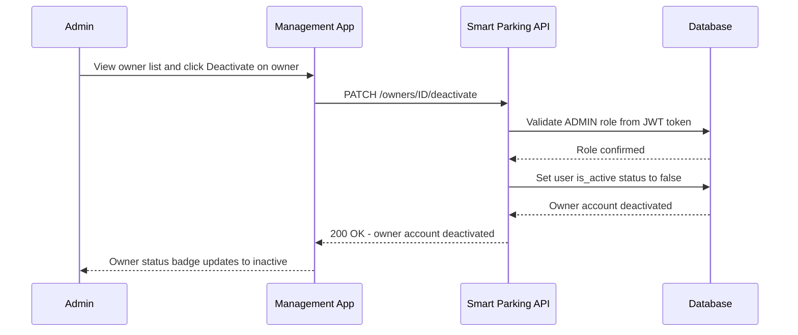

---

## 2.4.2 Parking Owner Sequence Diagrams

### 2.4.2.1 Owner Self-Registration

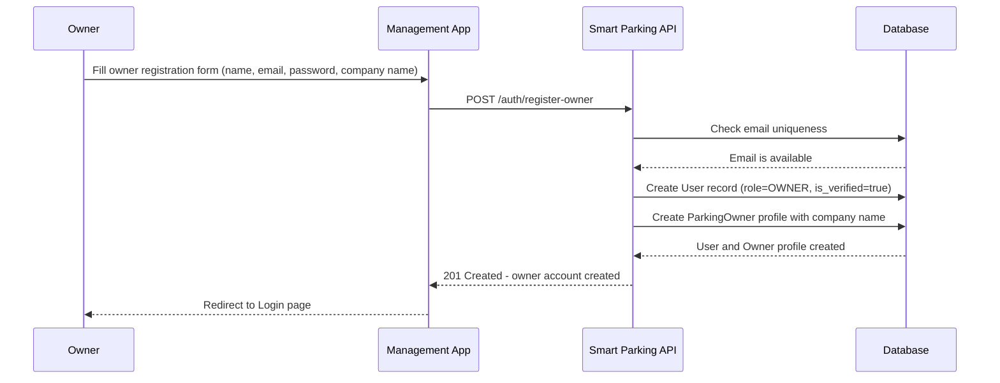

---

### 2.4.2.2 Create a Parking Lot with Floors and Slots

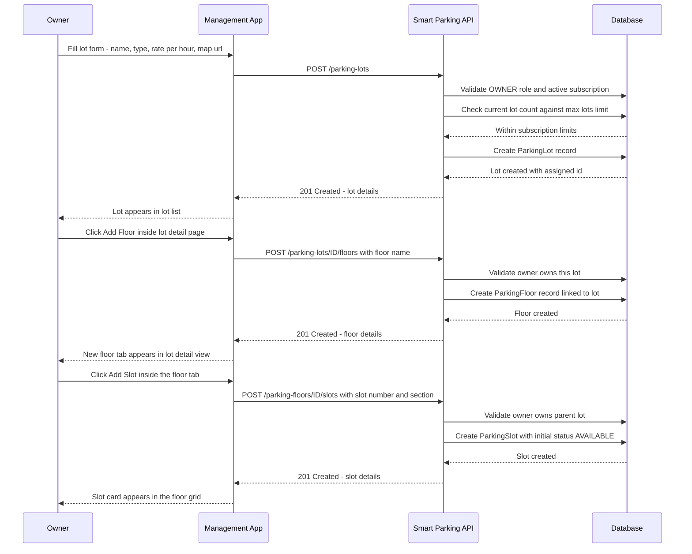

---

### 2.4.2.3 Subscription Purchase and Wallet Payment

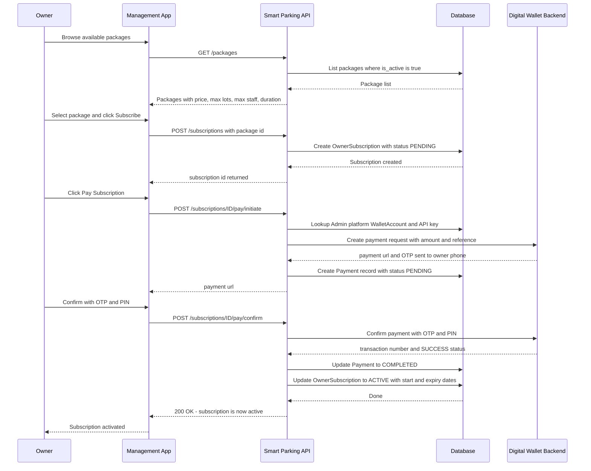

---

## 2.4.3 Parking Staff Sequence Diagrams

### 2.4.3.1 View Slot Board and Search Session by Plate Number

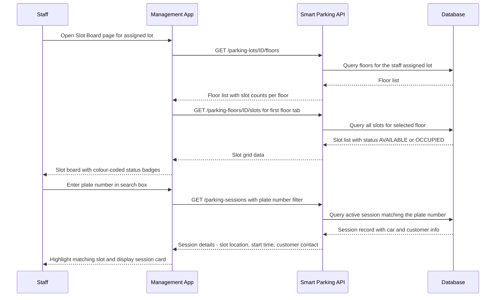

---

### 2.4.3.2 Finish an Active Parking Session

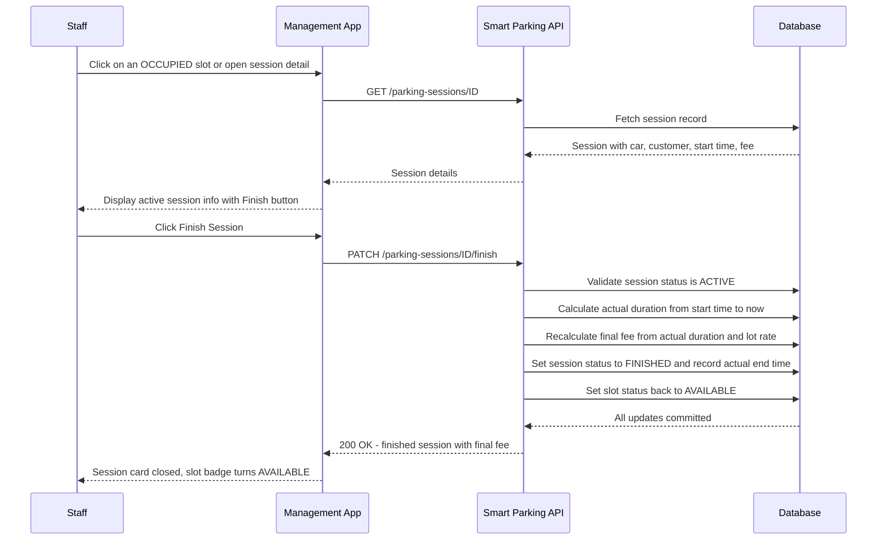

---

## 2.4.4 Customer Sequence Diagrams

### 2.4.4.1 Customer Registration and Email Verification

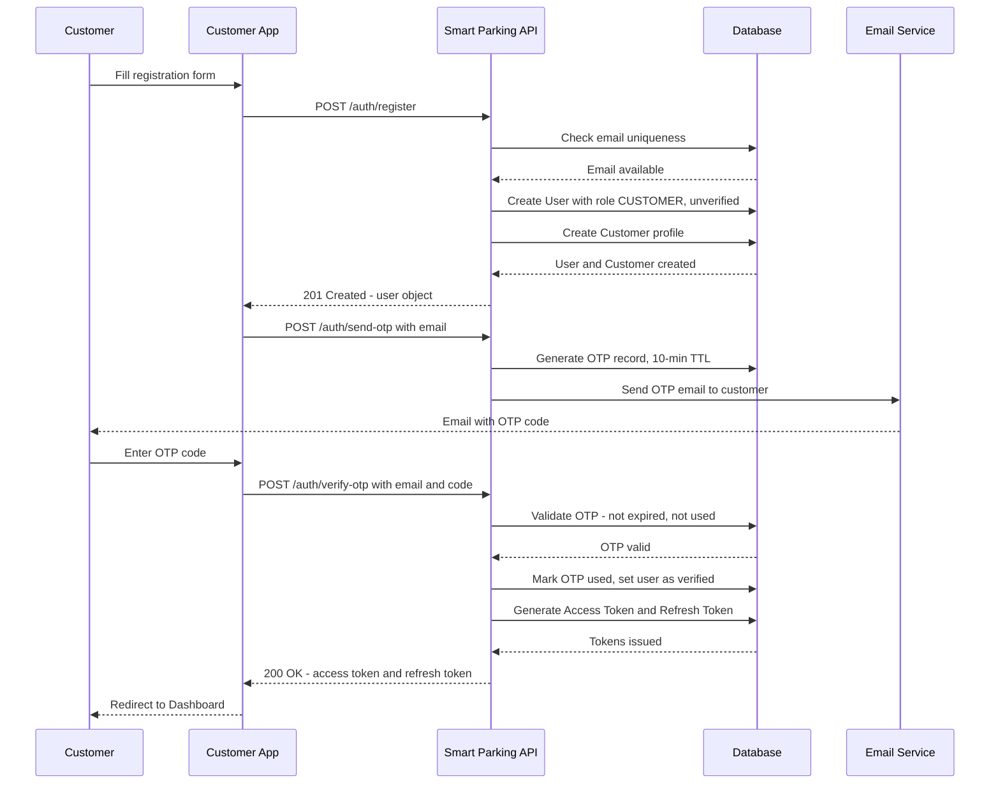

---

### 2.4.4.2 Book Parking Slot and Complete Wallet Payment

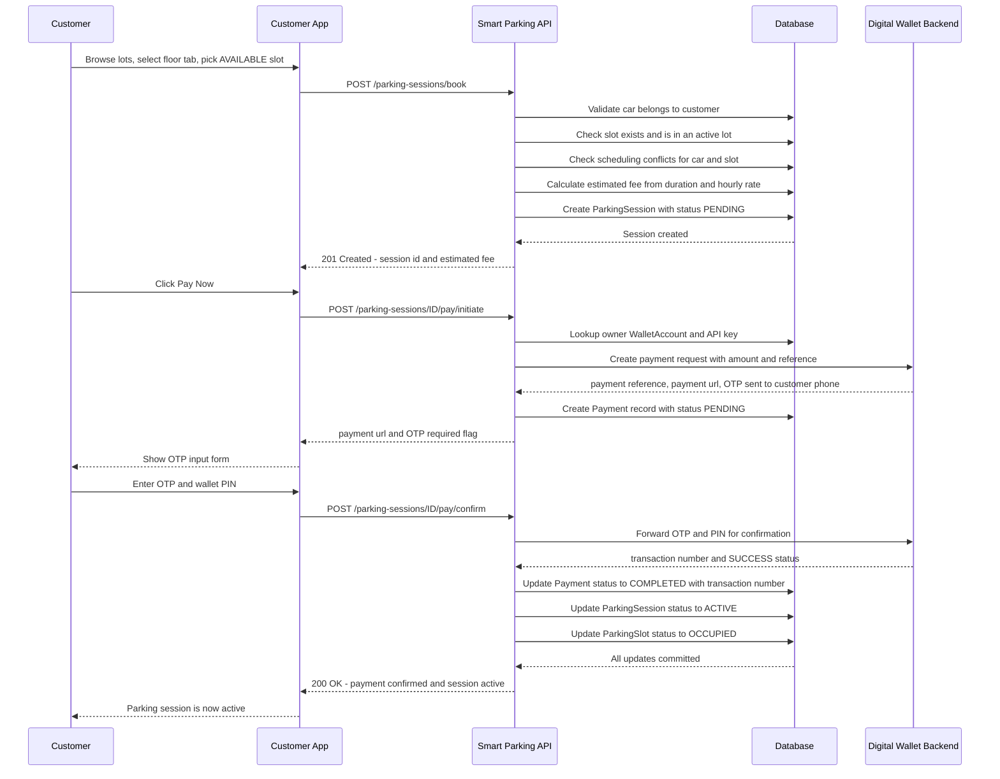

---

# Chapter 3 — Project Implementation

## 3.1 Architecture Overview

The system follows a **layered architecture** on the backend, separating concerns cleanly across four layers:

```
HTTP Request
    ↓
API Layer (app/api/v1/*.py)       — Route definitions, request parsing, auth dependency injection
    ↓
Service Layer (app/services/*.py) — Business logic, validation rules, orchestration
    ↓
Repository Layer (app/repositories/*.py) — Database queries, pagination helpers
    ↓
Model Layer (app/models/*.py)    — SQLAlchemy ORM class definitions (table schema)
    ↓
Database (SQLite / PostgreSQL)
```

Request/response data crosses layer boundaries as **Pydantic schemas** (`app/schemas/*.py`), which validate types, enforce constraints, and provide serialisation/deserialisation without coupling the service layer to ORM model internals.

---

## 3.2 Backend Implementation (`smart-parking-api`)

### Project Structure

```
smart-parking-api/
├── app/
│   ├── api/v1/          # API route handlers (one file per resource)
│   │   ├── auth.py
│   │   ├── parking_lot.py
│   │   ├── parking_session.py
│   │   ├── wallet_payment.py
│   │   └── ...          # 16 router files total
│   ├── config/          # Settings (env var loading via Pydantic BaseSettings)
│   ├── core/            # Constants (enums), custom exceptions, logging config
│   ├── database/        # SQLAlchemy engine, session factory, declarative Base
│   ├── dependencies/    # FastAPI dependency providers (auth, pagination)
│   ├── middleware/      # CORS, exception handlers, request logging
│   ├── models/          # SQLAlchemy ORM models (17 models)
│   ├── repositories/    # Data-access objects with pagination support
│   ├── schemas/         # Pydantic v2 request/response schemas
│   ├── services/        # Business logic services (19 service files)
│   └── utils/           # Utility helpers
├── migrations/          # Alembic migration files
├── scripts/             # Seed script (roles + admin account)
├── tests/               # Pytest test suite
├── table-design.sql     # Reference SQL DDL
└── requirements.txt
```

### Key Implementation Details

#### Authentication & Security
- JWT access tokens (short-lived) and refresh tokens (long-lived) are issued on login/OTP verification.
- On logout, the refresh token's `jti` (JWT ID) is stored in the `token_blacklist` table. A cleanup sweep on startup removes expired blacklist entries.
- Passwords are hashed using **bcrypt** via `passlib`. Plain-text passwords are never stored.
- The `get_current_user` FastAPI dependency decodes and validates the bearer token on every protected endpoint.

#### Session Booking & Fee Calculation
The `ParkingSessionService.book_session()` method enforces:
1. Only `CUSTOMER` role users can book.
2. Car must belong to the booking customer.
3. Slot must exist.
4. Start time must be in the future; end time must be after start time.
5. No scheduling conflict with the same car (active or pending sessions).
6. No scheduling conflict with the same slot (with a mandatory **2-hour buffer gap** before and after existing bookings).
7. Fee = `ceil(duration_minutes) / 60 × rate_per_hour`.

The session is created in `PENDING` state and transitions to `ACTIVE` only upon successful wallet payment confirmation.

#### Digital Wallet Integration
The `WalletPaymentClient` (`app/services/wallet_payment_client.py`) encapsulates all communication with the external digital wallet backend. It uses an `X-API-Key` (stored per `WalletAccount`) to authenticate requests. The payment flow is:
- **Initiate**: The API calls the wallet backend to create a payment request. The wallet sends an OTP to the customer's registered phone.
- **Confirm**: The customer submits the OTP and PIN to the Smart Parking API, which forwards them to the wallet backend. On success, the wallet returns a transaction number.

The `Payment` record tracks both the internal reference (`PP-XXXXXX`) and the external wallet references throughout this flow.

#### Subscription Enforcement
Before an owner can create a new parking lot, `ParkingLotService` checks the owner's active subscription against the package's `max_lots` limit. Similarly, `ParkingStaffService` checks the `max_staff` limit before adding staff to a lot.

---

## 3.3 Management Frontend Implementation (`smart-parking-management`)

The management portal serves three distinct user roles from a single React application, routing users to role-specific pages after login.

### Page Matrix

| Role | Dashboard | Lots | Staff | Sessions | Subscriptions | Wallet | Admin-Only |
|---|---|---|---|---|---|---|---|
| **Admin** | ✅ | View All | — | — | View All | Platform Account | Owners, Users, Packages, Payments |
| **Owner** | ✅ | Own Lots + Floors + Slots | Own Staff | Own Sessions | Own Subscription | Own Account | — |
| **Staff** | ✅ | — | — | Own Lot Sessions | — | — | Slot Board |

### Key Components

- **`AppSidebar`** — Dynamically renders navigation links based on the authenticated user's role, configured in `utils/navConfig.ts`.
- **`ProtectedRoute`** — Guards routes with both authentication checks and an `allowedRoles` allow-list.
- **`LotDetailPage` (Owner)** — A tabbed page for managing floors, slots within each floor, and staff assigned to the lot — all within a single, rich interface.
- **`SlotsBoardPage` (Staff)** — Displays all slots in a grid grouped by floor, with real-time status badges (`AVAILABLE` / `OCCUPIED`) and controls to mark vehicle entry/exit and finish sessions.
- **`SubscriptionPage` (Owner)** — Allows the owner to browse packages, initiate a subscription, and complete the two-phase wallet payment (initiate → confirm with OTP) entirely from the UI.
- **`WalletPage` (Owner / Admin)** — Manages the wallet account credentials (name, phone, API key) used to receive parking session and subscription payments.

---

## 3.4 Customer Frontend Implementation (`smart-parking-customer`)

The customer app provides a streamlined experience focused on discovery, booking, and payment.

### Key Pages

| Page | Path | Description |
|---|---|---|
| Register | `/register` | Multi-field registration form with validation |
| Verify Email | `/verify-email` | OTP input with countdown timer and resend |
| Dashboard | `/dashboard` | Active session card, quick links, nearby lots |
| Parking Detail | `/parking/:id` | Lot info, floor tabs, slot grid with availability, booking dialog |
| 3D Lot View | `/parking/:id/3d` | Interactive Three.js-powered 3D floor view |
| 3D Slot View | `/slots/:id` | 3D visualisation of a specific slot |
| Cars | `/cars` | CRUD interface for managing registered vehicles |
| Sessions | `/sessions` | History of all parking sessions with status and fee |
| Profile | `/profile` | Update name, phone; change password |
| Payment Result | `/wallet-payment/result` | Callback landing page after external wallet redirect |

### Booking Flow (UI)
1. Customer navigates to a parking lot's detail page.
2. Selects a floor tab, then clicks an `AVAILABLE` slot.
3. A booking dialog opens where the customer picks their car, sets start/end times, and previews the estimated fee.
4. On confirm, the customer is prompted to initiate wallet payment (enter wallet phone or use default).
5. The wallet service sends an OTP to the customer's phone; the UI shows an OTP input form.
6. On OTP + PIN confirmation, the session becomes `ACTIVE` and the slot shows as `OCCUPIED`.

---

## 3.5 Deployment

The system is containerised for consistent environment parity between development and production.

```yaml
# docker-compose.yml (simplified)
services:
  smart-parking-api:
    build: ./smart-parking-api
    ports: ["8000:8000"]
    env_file: ./smart-parking-api/.env

  smart-parking-management:
    build: ./smart-parking-management
    ports: ["3001:80"]

  smart-parking-customer:
    build: ./smart-parking-customer
    ports: ["3000:80"]
```

For cloud deployment, `render.yaml` defines three Render services: one Web Service for the API and two Static Sites for the frontends. The API's `DATABASE_URL` is swapped from SQLite to a managed PostgreSQL database on Render.

---

# Chapter 4 — Conclusion and References

## 4.1 Conclusion

The Smart Parking Lot Management System successfully demonstrates how a modern, multi-tenant web platform can address the real-world inefficiencies of traditional parking lot management. By combining a well-structured RESTful API backend, two role-differentiated frontend applications, and an external digital wallet payment integration, the system delivers end-to-end value across all stakeholder groups.

### Key Achievements

- **Clean role-based architecture** — Four distinct user roles (`ADMIN`, `OWNER`, `STAFF`, `CUSTOMER`) with strictly enforced permission boundaries at both the API and UI routing layers prevent unauthorised access to sensitive functionality.
- **Robust session lifecycle engine** — The booking system enforces conflict-free scheduling with car-level and slot-level checks, a 2-hour buffer gap policy, and an automated fee calculation, eliminating manual billing errors.
- **Two-phase digital payment integration** — The OTP-based wallet payment flow provides a secure, auditable payment trail for both session fees and subscription purchases, replacing error-prone cash handling.
- **Subscription-gated growth model** — The package/subscription system gives the platform administrator commercial control over how operators grow (max lots, max staff, duration), enabling a viable SaaS business model.
- **Production-ready deployment** — Docker containerisation and `render.yaml` cloud configuration ensure the system can be deployed reliably and consistently across environments.
- **Developer experience** — Auto-generated OpenAPI documentation (Swagger UI / ReDoc), a Postman collection, Alembic migrations, and a seed script make the system straightforward for developers to set up and iterate on.

### Limitations and Future Work

| Limitation | Proposed Future Enhancement |
|---|---|
| No hardware integration | Integrate ANPR cameras and barrier gates via MQTT/WebSocket |
| No native mobile apps | Build React Native apps using the existing REST API |
| Slot scheduling uses time-window booking only | Add support for walk-in (open-ended) sessions with real-time sensor data |
| No self-service password reset flow | Implement email-based password reset using a secure token link |
| No real-time slot status push | Integrate WebSocket notifications so the slot board auto-refreshes |
| SQLite in development | Always use PostgreSQL in staging/production for full concurrency support |

---

## 4.2 References

1. **FastAPI Documentation** — Sebastián Ramírez. *FastAPI — Modern, fast (high-performance) web framework for building APIs with Python.* https://fastapi.tiangolo.com

2. **SQLAlchemy 2.0 Documentation** — Mike Bayer et al. *SQLAlchemy — The Python SQL Toolkit and Object Relational Mapper.* https://docs.sqlalchemy.org/en/20/

3. **Pydantic v2 Documentation** — Samuel Colvin et al. *Pydantic — Data validation using Python type annotations.* https://docs.pydantic.dev/latest/

4. **Alembic Documentation** — Mike Bayer. *Alembic — A lightweight database migration tool for SQLAlchemy.* https://alembic.sqlalchemy.org/en/latest/

5. **React Documentation** — Meta Open Source. *React — A JavaScript library for building user interfaces.* https://react.dev

6. **TanStack Query v5** — Tanner Linsley. *TanStack Query — Powerful asynchronous state management for TypeScript/JavaScript.* https://tanstack.com/query/latest

7. **React Router v7 Documentation** — Remix Team. *React Router — Declarative Routing for React.* https://reactrouter.com

8. **Zustand** — Paul Henschel et al. *Zustand — A small, fast, and scalable bearbones state management solution.* https://github.com/pmndrs/zustand

9. **shadcn/ui** — shadcn. *shadcn/ui — Beautifully designed components built with Radix UI and Tailwind CSS.* https://ui.shadcn.com

10. **Tailwind CSS v4** — Adam Wathan et al. *Tailwind CSS — A utility-first CSS framework.* https://tailwindcss.com

11. **Vite** — Evan You. *Vite — Next generation front-end tooling.* https://vitejs.dev

12. **Docker Documentation** — Docker Inc. *Docker — Empowering App Development for Developers.* https://docs.docker.com

13. **JSON Web Tokens (JWT) Specification** — M. Jones, J. Bradley, N. Sakimura. *RFC 7519 — JSON Web Token (JWT).* https://datatracker.ietf.org/doc/html/rfc7519

14. **Recharts** — Recharts Group. *Recharts — A composable charting library built on React components.* https://recharts.org

15. **Axios** — Matt Zabriskie et al. *Axios — Promise based HTTP client for the browser and node.js.* https://axios-http.com

16. **React Hook Form** — Beier Liu. *React Hook Form — Performant, flexible and extensible forms with easy-to-use validation.* https://react-hook-form.com

17. **Zod** — Colin McDonnell. *Zod — TypeScript-first schema validation with static type inference.* https://zod.dev

---

*End of Document*
